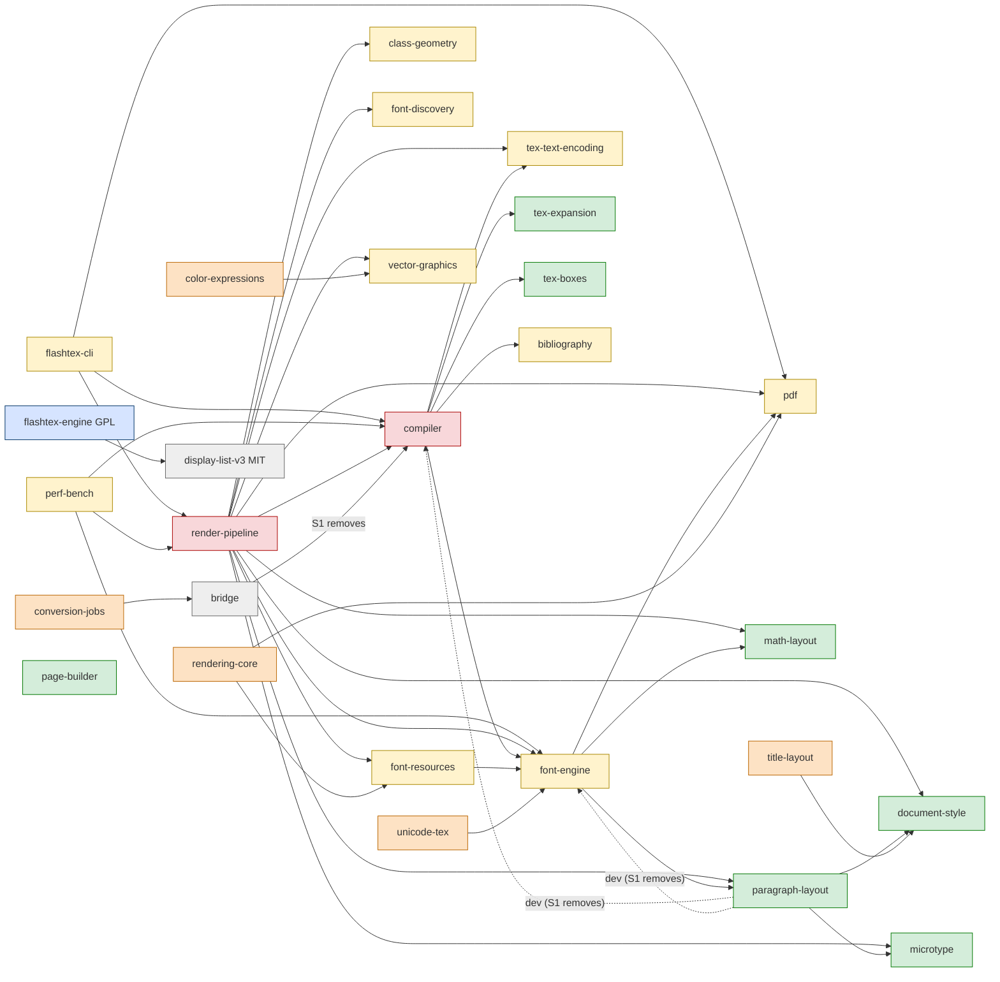

# Engine v2: P5 retirement plan (revision 2)

**Status:** a PROPOSAL for the Commander (lane P5-RETIREMENT-PLAN). It is docs only and
deletes no code. Revision 2 answers kabir-claude's NEEDS-FIX (16 findings and 4 rulings,
2026-09-30) and mac-claude-a's NOT-READY review (issue comment 5965569921). §9 maps each
finding to the section that resolves it.

**Governs:** nothing. [DESIGN.md](DESIGN.md) §3, §6.2, §10, §12 and §13 govern. Where this
plan and DESIGN.md disagree, DESIGN.md wins.

**Measured on:** `origin/main` `412c918ec` (2026-10-03, after #1343 and #1349 landed; first measured on `78ab04c99`, and every number and line was re-checked on `412c918ec`). "VERIFIED"
means this lane measured it on that tree with the commands in Appendix A. "REPORTED"
means it is quoted from DESIGN.md or a PR and was not re-measured here. "Belief" means
it is inferred.

**Author:** flashtex-2a/retirement-plan (claude-opus-5-5).

---

## 0. Summary

**What changed since revision 1:**
- **No soak.** Decision 3 deletes the old engine at once, once the new one has parity.
  The 14-day soak and the staged S7a–c deletion are gone. S7 is one deletion PR, queued
  as soon as S6 lands.
- **S5 carries decision 3's gate** (§4.2).
- **S6 requires the app-parity checklist** (#1337) closed, with a named test per row, and
  #1340–#1344 landed.
- **The engine switch evolves main's global switch.** `FlashTeX.EngineV3.enabled` /
  `FLASHTEX_ENGINE_V3` becomes a per-document choice (§5). Revision 1's
  `FLASHTEX_ENGINE` and JSON files are withdrawn.
- **Existing documents are never re-typeset silently** (ruling 4).
- **The v2 pane retires** rather than being adapted (DESIGN §6.2).
- **S1 is #1400's actual scope.** `supported-latex.json` is excluded and waits for the owner.
- **Licence work is an S6 precondition:** a source offer and the §3 legal review.
- **The inventory gaps are filled,** and every number is re-measured.

| | Count (VERIFIED at `412c918ec`) |
|---|---|
| §10-named crates retiring (compiler, render-pipeline): Rust src / tests | 162,689 / 84,589 |
| Crates with no consumer anywhere after S1 (S2, ruling 1): src / tests | 31,852 / 19,132 (10 crates) |
| Crates orphaned by S7, plus the CLI and perf-bench: src / tests | 82,946 / 17,262 (10 crates) |
| Kept as oracles, plus their 2 dependencies: src / tests | 40,993 / 17,135 (7 crates) |
| Swift retiring outright, sources / tests (§1.4) | 6,481 / 3,996 |
| Swift that waits on RQ7 (the preview-controller route) | 2,398 sources + 554 tests |
| Open PRs touching old-engine crates | 3 (#1120, #1400, #1401); revision 1 counted 88 |
| Stages | 10 (S0 done; S1 in review as #1400) |

### Stage table

"Green" is defined in §4.1. A revert dry-run (§4.3) is required for every stage that
deletes code.

| # | Stage | What lands | Gate, beyond green | Owner | Revert dry-run | Depends on |
|---|---|---|---|---|---|---|
| 1 | **S0** ✔ vendor/ retired | done: #1183 (`e1e17d8f6`) | — | — | — | — |
| 2 | **S1** Decouple (#1400) | (a) the paragraph-layout tests move into compiler tests; (b) bridge reads an MIT features table, and its glyph-reparse tests move; (d) the bundle verifier and manifest move to `apps/mac/scripts/`, with their callers repointed; (e) licence-boundary **check E** for apps/mac. **Excluded:** (c) `supported-latex.json` (RQ5). | No behaviour change: the feature list is byte-identical (193 entries); bundle-check JSON is identical; perf digests are unchanged; check E's negative self-test passes | mac-claude-a | not a deletion (plain revert) | — |
| 3 | **S1b** S1 follow-ups | Check E's four false negatives (#1400 review), and CI runs the boundary self-tests; a host field in the parity baseline (RQ8); remove the stale `crates/<crate>/target` probes in `ShellModel`; add `CaptureFeatures.swift` to the #1337 checklist (§1.5); S1(c), an MIT source for `supported-latex.json`, **only after RQ5** | Same as S1 | Commander assigns | not a deletion | S1; RQ5 for S1(c) |
| 4 | **S2** No-consumer cleanup (ruling 1) | Delete the §1.2 crates, `tests/test_rendering_v2.py` and `scripts/check_rendering_v2.py`. Fix every script, CI and doc reference **in the same PR**. Edit `clippy-debt.txt` and `rust-test-exclude.txt`. | Full tier on both OSes; `packaging-selftest.sh`; Appendix A.4 finds zero references outside `docs/evidence/` and `coordination/` | Commander assigns | **yes** | S1 (the verifier has left rendering-core) |
| 5 | **S3** Per-document engine choice | §5.2–§5.6: per-document storage, migration of the global key, the side-by-side switch, mid-edit rules, engine labels in logs and tools, and capture features per engine (§1.5). It builds on #1340–#1344 and does not redo them. The default for new documents stays the old engine. | `mac-app`, `ipad`; named tests for resolution order, key migration, no silent re-typeset, and a switch that leaves dirty buffers and in-flight compiles alone | J3 `P5-APP-PARITY` lane | not a deletion | #1340–#1344 landed |
| 6 | **S4** Gates that P5 needs | (a) the #1299 board on a hosted fallback leg, and a complete run; (b) a T4 v1 leg, or the Commander's T4 decision 1; (c) T2 completing on main; (d) a **no-TeX-Live gate**; (e) T7 on the reference host; (f) parity fixtures on the engine (`gate.sh` L427, `action.yml`, `parity.py --engine-kind`); (g) T0 in `CI required` (✔ #1336) | 10 consecutive green `merge_group` runs with the new jobs; 3 consecutive complete nightly boards | Commander (workflows) | not a deletion (revert CI) | RQ18 for (e) |
| 7 | **S5** Flip: new documents default to the new engine | `EngineV3.defaultForNewDocuments = true`; the nightly `parity-corpus` and parity fixtures default to the engine; `baseline-fixtures.json` re-recorded on its recording host. **Existing documents do not change** (§5.3). | **Decision 3's gate** (§4.2), plus T1 with 0 new differences and the §1.2 targets on T7 (the P4 exit) | Commander (one-line flip) | not a deletion (flip back) | S3, S4; RQ17 |
| 8 | **S6** App old route out | Delete the §1.4 Swift, including the v2 and v1 panes; helper rows, menu items and accessibility commands; docs; retarget tools and scripts (§1.8); the saved-data and defaults migration (§5.5); the old `CaptureFeatures` list (§1.5); `packaging-selftest.sh` must not pass vacuously | #1337 checklist closed, each row's named test passing and **not skipped** with the old helpers absent (§4.4); #1340–#1344 landed; the §6 licence preconditions (RQ19); RQ15 ruled; a CLI successor or the owner retires the CLI (RQ6) | J3 lane, then Commander | **yes** | S5 landed, with no soak |
| 9 | **S7** Old engine deleted at once | One PR deletes the compiler, render-pipeline, flashtex-cli, perf-bench and every §1.3 orphan, with all of their CI, scripts, generated entries and env (§1.7, §1.8). The TFM rule is in §2. | Full tier; `check-generated.py`; a release.yml dry-run; A.4 zero references; T7 has gated for ≥ 10 runs, so perf is never ungated; RQ5 ruled; 0 open old-path PRs | Commander assigns | **yes** | S6, queued as soon as it lands |
| 10 | **S8** Oracles to `tests/` and final sweep | Move the §2 crates to `tests/oracles/` (RQ4: move); `license` fields (R5); `gate.sh` mapping; docs | Full tier; A.4 zero references | Commander assigns | **yes** (a revert of the move) | S7 |

### Open questions for the owner

This plan does not decide these. Each is in §7.

| RQ | Question | Blocks |
|---|---|---|
| **RQ17** | P5 thresholds (reviews/2026-10-02.md **Q3**): confirm P-T1 ≥ 98 % and P-T2 ≥ 99 % on arXiv and T4, zero T4 panics, T2 clean, the no-TeX-Live gate and the app checklist, with **no soak** (decision 3) | S5 |
| **RQ18** | The T7 reference host (reviews/2026-10-02.md **Q1**) | S4(e), and therefore S5 and S7 |
| **RQ19** | The §3 legal review, and the source offer that goes with it | S6 |
| **RQ5** | Where `supported-latex.json` comes from once the compiler goes, given §3 (MIT data only) and LPPL provenance | S1(c), S7 |
| **RQ15** | Drop the `flashtex.toml` `[fonts]` roles? | S6 |

### For the Commander: please confirm

1. **Gates, not a soak.** Two waits in this plan could be mistaken for the soak that
   decision 3 removed. Neither counts elapsed time; each ends as soon as its gate passes.
   - **S4's "3 consecutive complete nightly boards"** asks that the #1299 board run
     complete and stay green three times in a row. That shows the board itself is
     reliable. It is a gate on evidence, not a waiting period. It could pass on three
     consecutive nights, or sooner if the board is also run on demand.
   - **S5's T7 latency requirement** is the P4 exit (§1.2 targets met on T7). It is a
     phase gate, not a waiting period.

   **Both depend on RQ18,** the T7 reference host:
   - S4 cannot finish without T7 (S4(e)), even though its board runs need only the board's
     runner or its hosted fallback (S4(a));
   - S5 needs T7 results;
   - without T7, perf-bench has no successor, so S7 cannot start either.

   **Please confirm that these are gates, not a soak**, or say which one you want dropped.
2. **Ruling 4 at S6** (§5.3): a document still on the old engine gets a one-time sheet
   that must be acknowledged, because there is no old engine left to show side by side.
3. **§10's TFM wording** (§2): only `math-layout/src/tfm.rs` survives, and it stays in place.
4. **The Commander's open RQs:** RQ3, RQ6, RQ7, RQ10 and RQ16 (§7).

---

## 1. Inventory of what retires

LOC is the newline count over tracked files. "src" is `*.rs` outside `tests/`, `benches/`
and `examples/`; "tests" is `*.rs` under them; "other" is every other text file
(Appendix A.1).

### 1.1 Crates named by §10

| Path | Rust src | Rust tests | Other | Files (bin) | §10 reason |
|---|---:|---:|---:|---:|---|
| `crates/compiler` | 89,157 | 39,547 | 65,471 | 754 (28) | Hand parser, package ports, the marker hand-off, and Appendix G copy #1 (`src/math.rs`) |
| `crates/render-pipeline` | 73,532 | 45,042 | 253,430 | 1,392 (52) | Adapter, typeset paths, the page-builder copy, and Appendix G copy #2 (`math*.rs`); TFM reader `src/tfm.rs` (280) |
| `crates/render-pipeline/vendor/` | — | — | — | — | Already retired (S0, #1183) |
| **Subtotal** | **162,689** | **84,589** | **318,901** | 2,146 (80) | |

"The three math layout copies" are copy #1 in the compiler, copy #2 in render-pipeline, and
copy #3 in `crates/math-layout`, which §10 keeps as an oracle. This plan reads §10 as
retiring copies #1 and #2 only (RQ3).

### 1.2 Crates with no consumer anywhere (S2, ruling 1)

A crate qualifies when it has no Cargo reverse dependency, no binary that an app bundles
or spawns, and no CI or script invocation once S1 has landed (Appendix A.2, A.4). The
Commander ruled that the derived list stands (RQ1).

| Path | src | tests | Other | References to fix in S2 |
|---|---:|---:|---:|---|
| `crates/bibtex-bst` | 5,377 | 115 | 35,125 | `clippy-debt.txt` L24. Kept instead if RQ16 rules that bundle-mode BibTeX reuses it. |
| `crates/collaboration-core` | 1,999 | 2,052 | 11 | coordination/ only |
| `crates/color-expressions` | 1,375 | 0 | 13 | coordination/ only |
| `crates/conversion-jobs` | 2,660 | 2,176 | 333 | coordination/ and docs/; its `flashtex-review-inbox` binary is not bundled |
| `crates/project-bundle` | 1,205 | 1,799 | 17 | coordination/ only |
| `crates/rendering-core` | 11,684 | 10,334 | 72,469 | `rust-test-exclude.txt` L10. After S1 its manifest copy and `probe_bundle_discovery.py` are internal. `make-app.sh`, `bundle-texmf.py` L57, `launch-check.sh` L172 and `texmf-acceptance.sh` L69 point at `apps/mac/scripts/` (S1). |
| `crates/spellcheck` | 1,379 | 778 | 13 | coordination/ only |
| `crates/title-layout` | 777 | 729 | 13 | compiler comments |
| `crates/toc-layout` | 778 | 537 | 12 | coordination/ only |
| `crates/unicode-tex` | 4,618 | 612 | 16,952 | none |
| **Subtotal** | **31,852** | **19,132** | **124,958** | 1,156 files (24 binary) |

S2 also deletes `tests/test_rendering_v2.py` and the script it imports,
`scripts/check_rendering_v2.py` (L23). CI never runs either. `protocol/rendering-v2.schema.json`
stays until S7, because pdf and render-pipeline still read it.

### 1.3 Crates orphaned once §1.1 goes (S7)

The Commander ruled that these retire (RQ2). Their only reverse dependencies are crates
that are themselves retiring.

| Path | src | tests | Other | Reverse dependencies today | Note |
|---|---:|---:|---:|---|---|
| `crates/flashtex-cli` | 3,602 | 1,381 | 34 | none (bundled; release.yml ships it) | Needs a successor or the owner's retirement (#1337 D5, RQ6) |
| `crates/perf-bench` | 3,559 | 0 | 770 | none (perf.yml) | Replaced by T7. Deleted only after T7 gates (§4.5). |
| `crates/class-geometry` | 6,031 | 2,125 | 5,797 | render-pipeline | |
| `crates/font-discovery` | 1,215 | 0 | 15 | render-pipeline | |
| `crates/vector-graphics` | 9,625 | 1,429 | 401 | render-pipeline, color-expressions | |
| `crates/bibliography` | 3,729 | 718 | 438 | compiler | |
| `crates/pdf` | 16,951 | 5,344 | 6,163 | cli, font-engine, render-pipeline, rendering-core | `flashtex-pdf-exact` is the old export route until S6 |
| `crates/font-engine` | 20,755 | 1,946 | 4,311 | compiler, font-resources, perf-bench, render-pipeline, unicode-tex; dev: paragraph-layout (removed by S1), rendering-core | |
| `crates/font-resources` | 13,757 | 4,089 | 4,809 | render-pipeline, rendering-core | Its TFM reader retires with it (§2) |
| `crates/tex-text-encoding` | 3,722 | 230 | 43,670 | compiler, render-pipeline | Its TFM reader retires with it (§2) |
| **Subtotal** | **82,946** | **17,262** | **66,408** | | 376 files (50 binary) |

**Not retiring:** `crates/bridge`. S1 removes its compiler dependency: `features.rs` L12
imports `COMMAND_GLYPHS`, and the test module at L36–40 imports
`diagnostics::Diagnostic`, `lexer::tokenize` and `math::{parse_tokens, MathList,
MathPackages}`. Its feature list goes to the conversion model for iPad captures, so it
is a user-visible contract. #1400 keeps it byte-identical (193 entries), and the
transfer protocol does not change.

The IDE crates stay: preview-controller, document-runtime, project-index, edit-ledger,
project-files, project-manifest, package-resolver and docstrip. RQ7 covers
preview-controller once its runtime-v1 producer is gone.

### 1.4 apps/mac (Swift)

DESIGN §6.2: the v2 path (`V2PreparedPage` → `GlyphRunRenderer` → `V2PageRasterizer`)
"is the old engine's pane and retires at P5". The v3 pane draws with `DL3Renderer`. So
the v2 and v1 panes **retire**; nothing in them is adapted.

**Retire outright in S6** (VERIFIED sizes):

| Path (`apps/mac/Sources/`) | LOC | What it is |
|---|---:|---|
| `FlashTeXMac/PreviewV2View.swift` (contains `V2PageRasterizer`, L631) | 1,490 | The v2 pane |
| `FlashTeXMac/GlyphRunRenderer.swift` | 618 | The v2 glyph renderer |
| `FlashTeXMac/PreviewV2Accessibility.swift` | 413 | v2 VoiceOver text |
| `FlashTeXMac/V2PageCache.swift` | 176 | v2 page cache |
| `FlashTeXMac/PreviewView.swift` | 210 | The v1 pane (`FLASHTEX_PREVIEW_V2=0`) |
| `FlashTeXProtocol/RenderingV2.swift`, `RenderingV2Fast.swift` | 1,102 + 1,229 | v2 decoders |
| `FlashTeXMac/DisplayListDelta.swift` | 433 | `display-list-v2-delta` |
| `FlashTeXMac/V2PageWindow.swift` | 204 | v2 window negotiation |
| `FlashTeXMac/WholeDocumentList.swift` | 210 | Whole v2 list for the old export and print |
| `FlashTeXMac/BundledMetrics.swift` | 155 | `FLASHTEX_TFM_DIRS` for flashtex-render |
| `FlashTeXProtocol/LayoutNegotiation.swift` | 74 | `FLASHTEX_LAYOUT_CAPABILITIES` |
| `FlashTeXMac/WorkerClient.swift` | 167 | The runtime-v1 worker |
| **Sources subtotal** | **6,481** | |

**Also removed in S6:**
- `ShellModel.swift`: `locateRenderPipeline`, `locateCompiler`, `locateDefaultProducer` and `attachDiscovered*`, and `FLASHTEX_PREVIEW_V2` (L105) and `FLASHTEX_LAYOUT_CAPABILITIES` (L489).
- `FlashTeXAccessibility/AccessibilityCommands.swift` L102–109: `attachBuiltCompiler` (⌘⇧K) and `attachRenderPipeline` (⌘⇧R), with their menu items (`FlashTeXMacApp.swift` L297–301) and palette entries (`CommandPalette.swift` L99–100).
- `ExactPDFExport.swift` (254): the `flashtex-pdf-exact from-v2` route and `FLASHTEX_PDF_EXACT` (L20) go. `ExportSession`'s publish step stays, because #1343's `startExternal`/`finishExternal` (`ExportSession.swift` L80, L104) uses it. `PrintController.swift` L85's refusal text goes with it.

**Tests retiring** (3,996): `PreviewV2Tests` 921, `LayoutCapabilityConsumerTests` 543,
`V2ImageTests` 375, `RenderingV2Tests` 367, `V2ConformanceTests` 362,
`BundledMetricsTests` 359, `V2WindowTests` 358, `DisplayListDeltaTests` 326,
`V2PathTests` 272 and `V2FontStoreIdentityTests` 113. `RealCompilerTests` (240) is
retargeted to the host. `ExactPDFExportTests` (53) shrinks.

**Waits on RQ7** (the preview-controller route; #1337 E5): `PreviewControllerClient` 424,
`ShellModel+Controller` 666, `ShellModel+DisplayCandidates` 836, `HistoricalPreview` 472,
and `HistoricalPreviewTests` 554.

**Moved into the v3 pane, or retired, by the lane that closes the #1337 row:**
`PreviewAnchor` 456 (row C7) and `PreviewPagesRotor` 243 (row C19).

**Shrinks:**
- `RuntimeV1.swift` (791) keeps only what diagnostics still need.
- `Fonts.swift` (358) and `ProjectFonts.swift` (440) shrink according to RQ15.

**Bundle and helpers:**
- `apps/mac/Fonts/` (11 MB; 688 tracked files; `texmf/` 3.0 MB, 620 files) feeds flashtex-render and the `FLASHTEX_{FONT,TFM,LM}_DIRS` environment in `gate.sh` L132–134 and ci.yml L725–728 (`rust-workspace`) and L797–799 (`rust-standalone`). It goes in S7, unless S4(d)'s no-TeX-Live bundle reuses it.
- `make-app.sh` `HELPER_TABLE` (L77–90) and `build-helpers.sh` `HELPERS` (L51–61): the rows `cli`, `compiler`, `pdf`, `render` and `pdf_exact` leave in S6. The `explain` row names `diagnostic-explanations`, which does not exist on main, so S6 drops it too. The host is built separately (`make-app.sh` L143, L472).
- `launch-check.sh` L190–198 and L417–418 (`COMPILER_IN_BUNDLE`, `RENDER_IN_BUNDLE`) and `faces-acceptance.py` L43–44 (which require bundled `flashtex-render` and `flashtex-pdf-exact`) are retargeted to the host in S6.
- `packaging-selftest.sh` L194–202 **skips** texmf-acceptance when `flashtex-render` is absent, so S6's gate would pass vacuously. S6 retargets that check to `flashtex-host` and makes a missing helper **fail**.
- User docs: `docs/user/gui.md` L391, 404, 633–634 and 725, and `docs/user/README.md` L71, for the attach commands.

### 1.5 apps/ios

The iPad companion has no engine code (D14), and no iPad Swift retires.
- `supported-latex.json` exists in three identical copies (1,530 lines; sha256 `2e121907…`): `crates/compiler/supported/`, `apps/mac/Sources/FlashTeXMac/Resources/` and `apps/ios/FlashTeXPad/Resources/`. `sync-supported-latex.sh` regenerates it from the compiler (L39, L45), and CI checks it in ci.yml L481 (`inventory`) and L964 (`mac-app`). S7 removes the source, so **RQ5 must be ruled before S7**. Until then the iPad copy is a static file and keeps working.
- `apps/ios/FlashTeXPad/Resources/review-workflow.json` L7 names a `/tmp/flashtex-compiler…`
  path. The file is loaded by `PadModel.swift` and `FlashTeXPadKit/ReviewedProposal.swift`.
  S1b checks whether the path field is used. If it is not, S1b removes the field;
  otherwise S6 retargets it. Either way the iPad build stays free of engine code.
- The bridge feature list (§1.3) is another compiler-derived input to the iPad capture
  flow. S1 keeps it byte-identical.
- **`apps/mac/Sources/FlashTeXMac/CaptureFeatures.swift`** (81 lines, MIT) is the Mac's
  own pinned `supported_features` list, sent with every `capture_convert` (transfer-v1).
  The bridge forwards it to the conversion provider.
  - **What it holds:** the 60 `COMMAND_GLYPHS` names and the parser's structures, pinned
    to compiler commit `49e6eb43…` (`compilerSHA`). It also has explicit "NOT supported"
    lines (`gather*`, `\mathbb`) that describe the **old** compiler's limits.
  - **Its test:** `CaptureFeaturesTests` (44 lines) re-derives the glyph list with
    `git show <sha>:crates/compiler/src/math.rs` and skips when that commit is absent. It
    links nothing.
  - **#1400 leaves it out of scope**, and #1337 has no row for it.

  | Stage | What happens to it |
  |---|---|
  | S1 / S1b | Unchanged. S1b adds it to the #1337 checklist as a capture row. |
  | S3 | The capture request sends the list that matches the **document's engine**. Old-engine documents keep today's list. New-engine documents send no "NOT supported" lines for features the new engine typesets, so the model is not told to avoid `gather*` or `\mathbb`. The new list comes from MIT data (RQ5's ruling covers its provenance). |
  | S6 | The old-engine list and the git-history test retire. One list remains, for the new engine, with a test that pins it to its MIT source. |
  | S7 | Nothing left to do: after S6 nothing reads the compiler. |

### 1.6 Tests outside the retiring crates

| Path | Action |
|---|---|
| paragraph-layout `tests/{adversarial,mismatch_fixtures,hyphenation_spans}.rs` (983 LOC) | Moved into compiler tests by S1 (#1400) |
| `#[ignore]`d tests pinned to `FLASHTEX_TEST_COMPILER`: `bridge/tests/proposal_validation.rs` L134–137, `document-runtime/tests/session.rs` L134–136, `preview-controller/tests/lifecycle.rs` L186–188, `preview-controller/tests/stdio.rs` L586–588 and L1051–1053 (plus the two crates' README mentions) | Retargeted to the host or deleted in S7. They don't break CI today because they are ignored, but they would rot silently. |
| `tests/test_rendering_v2.py` → `scripts/check_rendering_v2.py` | S2 |
| `font-resources/tests/{tfm_consumer,required_tfm}.rs` (`tfm_consumer` reads `font-engine/fixtures/tfm/ec-lmr10.tfm` through `include_bytes!`) | Retire with font-resources in S7 (§2) |

### 1.7 CI (`.github/workflows`)

| Job | Today (VERIFIED) | Action |
|---|---|---|
| `ci-required` needs (ci.yml L1099–1120) | plan, build, quick, boundary, inventory, gates, parity-fixtures[-hosted], engine-parity[-hosted], rust-workspace, rust-standalone, trip, etrip, pdftex-regression, mac-app, ipad | S7: remove `rust-standalone` and, once its engine kind is the only one, the old parity-fixtures condition (L1142–1148) |
| `rust-standalone` (L788–821), matrix render-pipeline and flashtex-cli | Builds and tests in `crates/<crate>` with the apps/mac/Fonts env | S7 |
| `inventory` (L470–487) | `sync-supported-latex.sh --check` | Repointed when RQ5 is ruled (S1b), and before S7 |
| `gates`: Core-14 step (L505–521, `fetch-glyphlist.sh`) | font-engine | S7 |
| `parity-fixtures` / `-hosted` (L543–594), run only for old-engine changes (#1298, plan L298–308) | Builds flashtex-cli (`action.yml` L23–34) | S4(f): add the engine kind. S7: drop the cli kind and the `old_engine_crates` list. |
| `engine-parity` / `-hosted` (L595–709) | The new engine's P-T1/P-T2 fixtures, `FLASHTEX_REQUIRE_TEXLIVE=1` | Unchanged |
| nightly `parity-corpus` (L117–206) | v1: builds flashtex-cli (L144, L169) | S5: default to the engine. S7: drop the v1 build. |
| nightly `corpus-t4` (L253–378) | New engine only; **no v1 leg** | S4(b) |
| nightly L504, L565–566, L613 | Loop over render-pipeline and flashtex-cli | S7 |
| `p5-scoreboard.yml` | Self-hosted NixOS only; `scoreboard-unavailable` just prints a notice; downloads a `corpus-t4-v1` artifact that nothing produces (L141–142) | S4(a), S4(b) |
| perf.yml `bench` | perf-bench over the old path | Dual-run with T7 from S4; deleted in S7 after T7 has gated |
| release.yml | `build-helpers.sh`, `package-cli.sh`, and smoke tests of `flashtex` and `flashtex-render` | S7: engine distribution and source archive (§6, RQ6) |
| `trip`, `etrip`, `pdftex-regression` | Required since #1336 | Unchanged |

### 1.8 Scripts and tools

| Path | Action and stage |
|---|---|
| `scripts/gate.sh` L427–428 `gate_parity_fixtures` (builds flashtex-cli); L463–472 `standalone_profile` | S4(f) adds the engine kind; S7 drops the cli kind and `standalone_profile` |
| `scripts/gate.sh` L132–134: `FLASHTEX_FONT_DIRS`, `FLASHTEX_TFM_DIRS` and `FLASHTEX_LM_DIR` → `apps/mac/Fonts` | S7, with apps/mac/Fonts, after checking the document-runtime and preview-controller tests (A.5) |
| `.github/actions/parity-fixtures/action.yml` L23–34, L48 | S4(f), then S7 |
| `tools/parity/parity.py` L113 `DEFAULT_FLASHTEX`; L1841–1843 `--engine` and `--engine-kind {auto,flashtex-cli,tex}` | S5: the default becomes the engine; S7: the `flashtex-cli` kind is dropped |
| `apps/mac/scripts/{bundle-texmf.py, launch-check.sh, texmf-acceptance.sh}` (verifier callers) | Repointed in S1 (#1400) |
| `apps/mac/scripts/{launch-check.sh L190–198, faces-acceptance.py L43–44, packaging-selftest.sh L194–202}` | S6 (§1.4) |
| `scripts/ci/build-helpers.sh`, `make-app.sh` `HELPER_TABLE` | S6 |
| `scripts/ci/package-cli.sh` | S7 (RQ6) |
| `scripts/ci/fetch-glyphlist.sh`, `scripts/render-corpus-v2.sh`, `tools/font-metric-sweep`, `tools/kernel-math-gap` | S7 |
| `scripts/caret_context_oracle.py` (`--flashtex` default is flashtex-render) | S6: retarget to the host |
| Old-path attribution: `tools/native-validation/mac-live/lib/typing_attribution.py` (L9–15, L328–348), `launch_summary.py` L58, `capture_cycle.py` (L122, L317–318), `tools/typing-bench/evidence.py` (L49–54, L143), and the `FlashTeXLog` prefixes `preview-v2:`, `compile:`, `display-candidate:`, `worker:` and `paint:` | S3 adds an engine label; S6 drops the old routes (§5.6) |
| `Cargo.toml` L11–14 (the comment on live siblings) and L23–29 (the `[profile.release]` pin "because perf-bench's committed baselines state the build profile") | S7 rewrites the L23–29 reason for the T7 bench's baselines and deletes L11–14 |
| `scripts/generated-manifest.json` (15 entries) | S7: compiler 8, font-engine 2, tex-text-encoding 2. math-layout's 3 stay. |
| `scripts/clippy-debt.txt` (bibtex-bst, class-geometry, compiler, font-discovery, pdf, vector-graphics, render-pipeline, cli, perf-bench) and `rust-test-exclude.txt` (rendering-core) | Each stage removes the crates it deletes |
| `tools/real-world-corpus`, `tools/visual-oracle`, `tools/typing-bench`, `tools/native-validation` | S6: retarget to the host. `native-validation/mac-live/reports/` is evidence and stays. |
| `tools/parity`, `lockstep`, `latex-suites`, `incr-bench`, `web2rust`, `displaylist`, `snapshot-bench` | Kept |

### 1.9 Docs and generated data

These are unchanged from revision 1.
- **Retire** with the code they describe:
  - `docs/proposals/{display-list-v2-delta, node-stream-inventory, font-system-math, packages-fonts-manifest, pdf-searchable-text, rendering-abi, contract-draft-review-ad922ea}.md`
  - `docs/contracts/{runtime-v1-layout-capabilities, rendering-v2-proposal}.md`
  - `docs/resources/ft005-duplication.md`
  - `docs/handoffs/paragraph-layout-forced-break/`
- **Rewrite:** `docs/user/compiler.md`, for the CLI successor; `docs/user/project-manifest.md` `[fonts]`, per RQ15.
- **Keep:** `docs/evidence/` (append-only), and `docs/contracts/runtime-v1*.md` until RQ7 is decided.
- **Generated data:** the compiler, font-engine and tex-text-encoding tables go with their crates.
- **Re-recorded:** `tools/parity/baseline-fixtures.json` (S5). perf-bench's baseline is deleted, not re-recorded (§4.5).

### 1.10 Saved user data, defaults and environment (VERIFIED)

| Item | Where | Rule |
|---|---|---|
| Edit ledgers | `Application Support/FlashTeX/ledgers/<sha16>` (`ShellModel+Controller.swift` L65–68), written only by the preview-controller route (#1337 E5) | §5.5 |
| Review history | `Application Support/FlashTeX/review-history/<id>.json` (`ReviewHistory.swift` L107–118) | Engine-neutral review decisions; kept as is |
| `HistoricalPreview` | In memory only (L442), so nothing persists | Goes with RQ7 |
| Captures, dirty snapshots, pairing, themes | Application Support | Engine-neutral; untouched |
| v3 output | `~/Library/Caches/FlashTeX/engine-v3/projects/<hash>-<pid>-<n>/{src,out}` (`EngineV3Host.swift` L109–115; `EngineV3Session.swift` L1401) | Unchanged; nothing is written into the project (§5.4) |
| Defaults removed in S6 | `FlashTeX.EngineV3.enabled` (`EngineV3Host.swift` L17) once migrated (§5.2); `FlashTeX.Preview.v1.debugStatus` (`ShellModel.swift` L146) | One-time migration with a test (§5.5) |
| Defaults kept | `FlashTeX.EngineV3.hostPath`, `.trustRecords.v2`, `FlashTeX.Preview.fontSmoothing`, `FlashTeX.PreviewZoom.v1` | v3 uses them |
| Environment removed in S6 | `FLASHTEX_PREVIEW_V2`, `FLASHTEX_LAYOUT_CAPABILITIES`, `FLASHTEX_PDF_EXACT`, `FLASHTEX_COMPILER` | |
| Environment kept | `FLASHTEX_ENGINE_V3` (§5.2), `FLASHTEX_HOST`, `FLASHTEX_V3_CACHE` | |

---

## 2. Kept as oracles and tests (§10, ruling 2)

| Crate | src / tests / other | Consumers after S7 | Moves in S8 |
|---|---|---|---|
| tex-expansion | 12,908 / 3,836 / 4,218 | its own tests; a T6 expander oracle | → `tests/oracles/` |
| tex-boxes | 3,655 / 1,146 / 4,326 | its own tests; a T6 box-builder oracle | → `tests/oracles/` |
| paragraph-layout | 6,649 / 5,914 / 41,200 | its own tests (no compiler dev-dependency after S1) | → `tests/oracles/`, with **document-style** (2,323 src) and **microtype** (1,678 src), its normal dependencies, kept only for that reason |
| math-layout | 11,394 / 3,518 / 1,771 | its own tests. Today its only Cargo consumers are font-engine and render-pipeline, both retiring. | → `tests/oracles/` |
| page-builder | 2,386 / 245 / 105,214 | its own tests and `oracle/fixtures` | → `tests/oracles/` |

**TFM readers (ruling 2).** None of the kept crates depends, by Cargo or in code, on
tex-text-encoding, font-resources or render-pipeline's TFM code (VERIFIED). The only hit
is a doc comment at `microtype/src/lib.rs` L15.
- **Survives:** `math-layout/src/tfm.rs` (187 LOC). It is `pub mod tfm` (lib.rs L26), and math-layout's own `cm.rs`, `ams.rs`, its generated `cm_tfm.rs`/`ams_tfm.rs` and `tests/math_font_kerns.rs` use it. It is the only TFM reader a kept crate depends on. It **stays where it is**, inside math-layout, and is neither moved nor extracted. If an engine-side differential test needs it, it uses math-layout's existing public module (GPL → MIT, allowed).
- **Retire with their crates in S7:** `tex-text-encoding/src/tfm.rs` (287), `font-resources/src/tfm.rs` (680, plus `required_tfm.rs` and `tfm_run.rs`, and the tests `tfm_consumer.rs` and `required_tfm.rs`) and `render-pipeline/src/tfm.rs` (280). Revision 1's `tests/oracles/tfm-readers` crate is withdrawn.
- **The engine's own TFM loader** is tex.web's `read_font_info` (`flashtex-engine/src/generated/body_3.rs` L3071). The T6 TFM parser fuzzer compares it with math-layout's reader.
- The Commander amends §10's "the TFM readers" to match. This plan does not edit DESIGN.md.

**Why move the oracles under `tests/`** (RQ4, ruled: move): it makes the product/oracle
split visible and keeps the oracles out of the §14 "unused crates" metric. **Cost:**
`members` gains `"tests/oracles/*"`, and the `gate.sh` path→package mapping and the
ci.yml `plan` filters learn the new root. **Licence:** the oracles stay MIT and never
depend on flashtex-engine; check A enforces this.

---

## 3. Dependency graph

### 3.1 Cargo

Path dependencies from `cargo metadata --no-deps` (42 packages); `-.->` marks a dev
dependency. This is unchanged from revision 1 except for the edges S1 removes, which are
marked "S1".

**Reverse dependencies that block a deletion:**
- compiler ← bridge and paragraph-layout (both removed by S1), flashtex-cli, perf-bench, render-pipeline;
- render-pipeline ← flashtex-cli, perf-bench;
- font-engine ← font-resources, unicode-tex, perf-bench, rendering-core (dev);
- pdf ← font-engine, rendering-core, flashtex-cli.

S7 deletes them all in one PR, so the order inside S7 does not matter.

### 3.2 Non-Cargo edges

- **Mac app → binaries** (spawned, never linked): `flashtex-render`, `flashtex-compiler`,
  `flashtex-pdf-exact` and `flashtex-preview-controller` (old route, out in S6),
  `flashtex-bridge` (stays) and `flashtex-host` (the new engine).
- **iPad → data:** `supported-latex.json`, and indirectly the bridge feature list.
- **CI and scripts → crates:** §1.7 and §1.8.

### 3.3 MIT→GPL edges the switch-over could tempt (§3 forbids every one)

There are none today. Check A covers Cargo, check B covers apps/ios, and #1400's check E
covers apps/mac.

| Tempting edge | Safe route |
|---|---|
| CLI → engine | A GPL CLI next to `flashtex-host`, or an MIT CLI that spawns the host over display-list-v3 (RQ6) |
| T7 bench → engine internals | The bench on the GPL side, or driving the host over the socket |
| preview-controller → engine | It spawns `flashtex-host` (RQ7) |
| bridge → engine data | An MIT table (S1) |
| `supported-latex.json` generated from engine code | Forbidden for the iPad (§3); RQ5 |
| apps/mac linking a Rust static library | Refused by check E (E1–E4) |
| oracle → engine | Differential tests live on the engine side (GPL → MIT) |

---

## 4. Stages

### 4.1 "Green"

- `scripts/gate.sh pr` passes locally before the push.
- **`CI required` passes.** Its needs on main (ci.yml L1099–1120, VERIFIED) are plan,
  build, quick, boundary, inventory, gates, parity-fixtures[-hosted], engine-parity[-hosted],
  rust-workspace, rust-standalone, **trip, etrip and pdftex-regression** (required since
  #1336), mac-app and ipad. In a merge queue one `engine-parity` leg must succeed
  (L1137–1140).
- perf.yml `engine performance` passes until S7, and T7 passes from S4 on.

### 4.2 Decision 3's gate (S5)

S5 lands only when all of these hold **on one SHA**:

1. **The #1299 scoreboard is all green on a complete nightly run.** That means no partial
   or missing row and new ≥ old on every row, including the T4 rows. The T4 (old) row
   needs S4(b).
2. **P-T1 ≥ 98 % and P-T2 ≥ 99 %** of measured documents on the arXiv and T4 tiers.
3. **Zero panics on T4.**
4. **T2 has 0 unexpected failures.**
5. **The no-TeX-Live gate passes** (S4(d)). It builds the format from the TTBv1 bundle
   (#1216) on a runner without TeX Live and runs the parity fixtures to P-T2.
6. **The §10 app-parity checklist (#1337) is closed** (§4.4).
7. arXiv L1 ≥ 90 %, the current §12 text, which stands until the owner confirms decision
   3's thresholds (RQ17).

This plan adds two items, both from the phase order (P4 before P5): **T1 has 0 new
differences**, and **the §1.2 latency targets are met on T7**.

**Status (REPORTED, DESIGN §12, 2026-10-02):** the parity numbers are met on lane-run
evidence (arXiv 140/140 on every level; T4 1,892/1,892 and 1,275/1,276 on one build).
None of it is gated:
- the official board has never run on main;
- T2 has never completed on main;
- no no-TeX-Live gate exists;
- the checklist is open;
- T7 does not exist.

This lane did not re-measure any of it.

### 4.3 Revert dry-run (every deletion stage: S2, S6, S7, S8)

The dry-run reverses **only the stage's own change**, never main's commits since the
branch point. The stage's change is the diff from the first parent of its merge commit
(`<stage-merge>^1`) to that merge commit. Before the PR is queued, the author takes
`<stage-merge>` from a local `git merge --no-ff` of the PR head into current main, made
on a scratch branch.
1. **Check that the reverse applies:**
   `git diff <stage-merge>^1 <stage-merge> | git apply -R --check`, run on current main.
2. **Revert it:** on a scratch branch from current main, `git revert --no-edit -m 1 <stage-merge>`.
3. **Then the dry-run must show all of these:**
   - the revert **applies cleanly**, with 0 conflicts;
   - `cargo metadata` resolves;
   - `scripts/gate.sh pr` **passes afterwards**;
   - the stage's own check passes: `packaging-selftest.sh` for S2 and S6,
     `cargo check --workspace` and `check-generated.py` for S7, and the `members` and
     `gate.sh` mapping for S8.
4. **Record** the time taken, the conflict count and the gate result in the PR body.

`git revert <merge-base>..HEAD` and `git diff HEAD <merge-base>` are wrong here. On a
branch that has merged main, both also undo main's own commits since the merge base.

When the stage lands, the Commander tags `pre-retire-<stage>` on `<stage-merge>^1`. Any
path can then be restored with `git checkout <tag> -- <path>`. When S7 is queued, the S6
dry-run is repeated on top of S7: first S7's merge is reversed, then S6's. That way the
cost of a full restoration is known while it is still cheap.

### 4.4 The app-parity checklist (S5 and S6)

#1337's audit has 69 rows (14 has, 9 partial, 29 missing, 17 different). "Closed" means
every row is either **done, with a named test**, or **retired by the owner** in writing
(decision 3: "explicitly retired by the owner"). The rows map to tests through a file in
the repository that lists row → test id, and a CI check fails if a named test is missing
or **skipped** (#1342's and #1343's runs show skips when no host is present). These rows
must name their tests:

| Area | #1337 rows | Test (existing or to write) |
|---|---|---|
| Export PDF | D1, D2 | `EngineV3ExportTests` (#1343, landed), plus a P-T2 compare of the exported PDF against the oracle |
| Print | D3 | `EngineV3ExportTests` print path, or `PrintControllerTests` under v3 |
| Hyperref link clicks | C8 | A new `EngineV3LinkTests` (internal destinations and URIs) |
| VoiceOver page text and the Pages rotor | C18, C19, C20, B12 | A new `EngineV3AccessibilityTests`, including a rotor test |
| Scroll anchoring across reflow and resize | C7, C6 | A new `EngineV3AnchoringTests`, or `PreviewAnchoringTests` ported to v3 |
| SyncTeX: forward and reverse search in the app | C14, C15 | `EngineV3SearchTests` |
| SyncTeX: a file for external viewers | "absent on both paths" in #1337; listed in §10's audit | The owner retires it, or a lane builds it with a test |
| One engine at a time; ⌘B and auto-compile; bibliography and index | A1–A4, A10, A11 | `EngineV3OneEngineTests` (#1340), `EngineV3CompileCommandTests` (#1342), `EngineV3ToolsTests` (#1344) |

S5 needs the checklist closed. S6 also needs every named test to pass **on S6's own
tip, with the old helpers absent from the bundle**, so that no row is satisfied by old
code.

### 4.5 Perf digests

- perf.yml gates output digests everywhere and timings only on the same host. Its one
  baseline (`linux-x86_64-ryzen7-7800x3d.json`, host `nixos`) holds the **old path's**
  digests. Under D13, a digest change before S7 is a behaviour change with its own
  re-record PR.
- The new engine's digests are **new baselines**, recorded on the T7 reference host by its
  owner (RQ18), never on another host (§8).
- perf-bench is deleted in S7 **only after T7 has gated for ≥ 10 runs**, so perf is never
  ungated. S7 rewrites `Cargo.toml` L23–29's profile-pin reason for the T7 baselines.
- `baseline-fixtures.json` stores no host. S1b adds the field before S5 re-records it on
  the same Mac class.

---

## 5. Engine switch: from the global switch to a per-document default

### 5.1 What main has today (VERIFIED)

- One **global** switch: UserDefaults `FlashTeX.EngineV3.enabled` and the environment
  variable `FLASHTEX_ENGINE_V3=1|0`, which wins (`EngineV3Host.swift` L11–L30), plus
  *View ▸ Engine v3 Preview*. Default off.
- The v3 pane draws with **`DL3Renderer`** (`FlashTeXPreviewV3`). The v2 path retires
  (§1.4).
- **#1340 (landed):** one engine at a time. With v3 on, the old engine compiles nothing,
  and `suspendOldEngineForV3()` drops its result.
- **#1342 (landed):** ⌘B, auto-compile and the include watchers drive v3.
- **#1343 (landed, `069a43bd6`):** Export PDF and Print under v3 use the host's
  `export: true` run.
- **#1344** (bibtex, biber and makeindex over protocol 3.2) is open, and mac-claude-a is
  landing it. #1337, the gap audit, is open as well.

This plan invents no second variable and no JSON file.

### 5.2 What S3 adds: a per-document choice

The engine for a document is resolved in this order, highest first:

1. **`FLASHTEX_ENGINE_V3=1|0`** (existing). It forces every document, for CI, tests and
   developers, and the status bar says "(set by environment)".
2. **The user's explicit choice** for this document: *Typeset ▸ Engine ▸ New / Previous*.
   Product text says "pdfLaTeX-compatible", never "TeX engine" or "pdfTeX" (§3).
3. **The engine an existing document was last typeset with.**
4. **The default for new documents:** a compiled-in constant,
   `EngineV3.defaultForNewDocuments`. It is `false` in S3; the one-line S5 PR sets it to
   `true`.

**Storage.** One UserDefaults dictionary in the existing namespace,
`FlashTeX.EngineV3.documents`, keyed by the canonical project root plus the entry path:
`{engine: new|old, source: user|record, set_at, app_version}`. It is app-local and never
in the project, so nothing reaches collaborators through git.

**Migrating the global key.** A user who turned `FlashTeX.EngineV3.enabled` on has
already chosen the new engine. At the first launch of S3, that becomes an explicit
`source: user, engine: new` for every document in Recents. Until S6, the global key is
read only as a fallback for documents not yet in the dictionary. The menu item becomes
*Use the New Engine for All Documents*, which writes explicit choices. It never changes
the default.

**New versus existing.** A document is **existing** if the app has a record of typesetting
it with the old engine: Recents, stored pages, a ledger or review history. Any other
document is **new**, including a `.tex` file opened for the first time. Nobody has seen
FlashTeX typeset it, so nothing is re-typeset.

### 5.3 No silent re-typesetting (ruling 4)

- **New documents** follow the default: the old engine in S3–S4, the new engine from S5.
- **Existing documents never switch on their own.** Revision 1's
  `new-for-new-documents` → `new` step is withdrawn.
- An existing document switches only through one of these user actions:
  - *Typeset ▸ Engine ▸ New*.
  - The one-time banner "Compare with the new engine". It runs one new-engine compile
    and shows it **side by side** with the current pages. The user picks *Switch* or
    *Keep*, and the answer is stored as `source: user`.

  This is the only time both engines run for one document, and only on request. #1340's
  one-engine rule holds otherwise.
- **At S6 the old engine is gone.** A document still recorded as `old` opens with a
  one-time sheet saying that the new engine now typesets it. The new pages appear behind
  the sheet. The record switches only after the user acknowledges the sheet. Nothing in
  the project changes, and a PDF exported earlier stays on disk. **[Commander to confirm
  that this meets ruling 4 once there is no old engine left to show side by side.]**

### 5.4 Documents being edited

- **When the engine is chosen.** It is resolved only when a document **opens**. A change
  to the default (S5, an app update) applies at the next open; an open window keeps its
  engine.
- **An explicit switch in an open window** uses #1340's path. The in-flight compile
  finishes or is superseded, never killed half-written, and the other engine compiles the
  **current buffers**, saved or not.
- **Dirty buffers** (`DirtySnapshots`) are never touched or saved by a switch.
- **Output location.** The new engine writes `.aux`, `.log` and the PDF under
  `~/Library/Caches/FlashTeX/engine-v3/projects/…/out` (§1.10). Nothing is written into
  the project directory or its git. The old engine writes nothing there either.

### 5.5 Saved data and settings (applied in S6)

| Data | Rule |
|---|---|
| Edit ledgers (`ledgers/`, preview-controller route) | Kept on disk untouched. If RQ7 keeps the controller for history, the Edit History panel reads them as before. If not, *Settings ▸ Storage* lists them and offers *Remove history from the previous engine*. **Nothing is deleted silently.** |
| Review history (`review-history/*.json`) | Engine-neutral; kept and readable |
| `HistoricalPreview` | In memory only; nothing to migrate |
| `FlashTeX.EngineV3.documents` | Kept; it records which documents were acknowledged (§5.3) |
| `FlashTeX.EngineV3.enabled`, `FlashTeX.Preview.v1.debugStatus`; the old environment variables (§1.10) | A one-time defaults migration at the first launch of the S6 build removes them. A test asserts that none is read any more. |
| Users who chose *Previous* (`source: user, engine: old`) | They get the S6 sheet with the reason ("the previous engine was retired in version X") and a link for reporting a difference |

### 5.6 The overlap (S3–S5)

- **Export and Print** use the document's engine: the new engine through `export: true`
  (#1343), the old one through `flashtex-pdf-exact`. The two are never mixed.
- **Engine labels.** Diagnostics carry the engine that produced them. So do the local
  attribution tools of §1.8 (`typing_attribution`, `launch_summary`, `capture_cycle`,
  `typing-bench/evidence.py`) and the `FlashTeXLog` prefixes. S3 adds the label and S6
  drops the old routes. Without the label, dogfooding evidence is attributed to the
  wrong engine.
- **Faults.** The host restarts with backoff. After the crash limit, a banner offers the
  previous engine for that document (S3–S5 only). The user must choose; a silent fallback
  would hide parity bugs.
- **No telemetry.** The gate evidence lives in the repository (§4.2). *Help ▸ Copy Engine
  Report* copies local JSON (version, engine per document, recent outcomes and timings,
  crash counts, no content) that the user can paste into an issue.

### 5.7 Rollback

- **Before S6:** set `defaultForNewDocuments` back to `false` (a one-line PR). Users can
  switch any document back from the menu. No code is reverted.
- **From S6 on:** revert from the `pre-retire-*` tag. The revert dry-run (§4.3) tells us
  the cost before the stage lands.

---

## 6. Licence: an S6 precondition

Until S6 the MIT app exports and prints through the MIT `flashtex-pdf-exact`. **After S6
the only export and print route is the GPL `flashtex-host`.** It links xpdf, so it is
distributable under GPL v2 or v3 only (DESIGN §3). The app ships the host as a separate
executable: this is aggregation, and check E refuses any link. Before S6 lands:

1. **The §3 legal review is done.** The owner arranges it (RQ19); this plan does not
   decide it.
2. **A written source offer ships in the app.** It covers `flashtex-host`, `flashtex-initex`
   and their linked libraries at the versions in `third_party/{kpathsea,zlib,libpng,xpdf}/README.md`.
   The GPL v2 and v3 texts go in the bundle, with a link from *About*.
3. **release.yml publishes the matching source** for every tagged app build.
4. **The CLI.** release.yml ships an MIT `flashtex` CLI built from the old engine, and S7
   removes it. Its successor, or the owner's decision to retire it (#1337 D5), needs the
   same source offer. This is Tier-1 (RQ6).

---

## 7. Open questions (RQ) and risks

The plan's questions are renamed Q* → RQ*, keeping their numbers. RQ17–RQ19 are new.

| RQ | Question | Owner | State |
|---|---|---|---|
| RQ1 | The "ten unused crates" list (§1.2) | Commander | **Ruled:** follow the plan |
| RQ2 | Retire the §1.3 orphans | Commander | **Ruled:** retire (S7) |
| RQ3 | §10's "three math layout copies" means copies #1 and #2; math-layout stays | Commander | Open (§10 wording) |
| RQ4 | Move the oracles under `tests/` | Commander | **Ruled:** move (S8) |
| **RQ5** | Where `supported-latex.json` comes from (§3: MIT data only; LPPL names to the legal review) | **Owner** | Open; blocks S1(c) and S7 |
| RQ6 | Release artifacts and the CLI successor (Tier-1; licence) | Commander, then owner | Open; blocks S6 and S7 |
| RQ7 | preview-controller after S6: retire it, or keep it for ledger and history | Commander (J3) | Open; decides 2,398 Swift LOC |
| RQ8 | Host field in the parity baseline | — | S1b |
| RQ9 | T7 host | — | Superseded by RQ18 |
| RQ10 | Open old-path PRs before S7 | Commander | 3 open (#1120, #1400, #1401); must be 0 at S7 |
| **RQ15** | Drop the `[fonts]` roles (#1337 A9) | **Owner** | Open; blocks S6 |
| RQ16 | Bundle-mode BibTeX: reuse the MIT `bibtex-bst`? (decision 4 ports the tools later) | Commander | Open; decides whether bibtex-bst leaves in S2 |
| **RQ17** | P5 thresholds (reviews/2026-10-02.md Q3), under decision 3 (no soak) | **Owner** | Open; blocks S5 |
| **RQ18** | T7 reference host (reviews/2026-10-02.md Q1) | **Owner** | Open; blocks S4(e), and therefore S5 and S7 |
| **RQ19** | The §3 legal review and the source offer | **Owner** | Open; blocks S6 |

RQ11–RQ14 were never used.

| Risk | Mitigation |
|---|---|
| R1. The gates P5 needs are not complete in CI: no T7, no hosted fallback for the board, T2 never completed, no T4 v1 leg, no no-TeX-Live job | S4 |
| R2. `supported-latex.json` loses its source at S7 | RQ5 ruled before S7 |
| R3. Old-path PRs conflict with S7 | Only 3 remain; RQ10 |
| R4. A Swift link to GPL | Check E (#1400), plus its four false-negative fixes (S1b) |
| R5. 23 of 42 packages have `license = None` | S8 adds `license = "MIT"`; `cargo metadata` must show no `None` |
| R6. Packaging breaks when rendering-core goes | S1 moves the verifier before S2 |
| R7. The P5 evidence is lane-run, not gated | §4.2: the official board, on one SHA |
| R8. The rollback window after S7: a large revert grows costly as changes stack on top | No time-based soak (decision 3). Instead: the revert dry-run per stage (§4.3), the `pre-retire-*` tags, S6 and S7 landed back to back so nothing stacks between them, and a parity gate (§4.2) rather than elapsed time before deleting |
| R9. A checklist row is satisfied by old code | §4.4: named tests must pass on S6's tip with the old helpers absent, and a skipped test counts as missing |

---

## 8. What this plan does not do

- It edits neither DESIGN.md nor any code. The only other file this PR changes is
  `tools/parity/retirement-stages.json`, the stage list that `scoreboard.py` reads, which is
  updated to match §0.
- It does not redo #1340–#1344 (the J3 stack) or #1400 (S1).
- It does not decide RQ5, RQ15, RQ17, RQ18 or RQ19.

---

## 9. Findings addressed

kabir-claude's review findings are K1–K16, and K17–K18 are his minor items. His four
rulings are CR1–CR4. mac-claude-a's NOT-READY items are M1–M8.

| # | Finding | Resolved in |
|---|---|---|
| K1 | bridge uses more of the compiler than `COMMAND_GLYPHS` (features.rs L36–40, tests); the feature list is a user-visible contract | §1.3 "Not retiring", §1.5; S1 (#1400) moves the tests and keeps the list byte-identical |
| K2 | `gate.sh` `gate_parity_fixtures`, `action.yml` and `parity.py` default to flashtex-cli | §1.7, §1.8; S4(f), S5, S7 |
| K3 | The verifier's other consumers: `bundle-texmf.py`, `launch-check.sh` | §1.2, §1.8; S1 (#1400) |
| K4 | Swift and scripts missing: PrintController/`FLASHTEX_PDF_EXACT`, the attach commands, menus and palette, user docs, `faces-acceptance.py`, launch-check, the vacuous `packaging-selftest` | §1.4 (bundle and helpers), §1.8; S6 |
| K5 | Ignored `FLASHTEX_TEST_COMPILER` tests | §1.6; S7 |
| K6 | `test_rendering_v2.py` needs `check_rendering_v2.py` | §1.2, §1.6; S2 |
| K7 | `Cargo.toml` profile-pin reason | §1.8, §4.5; S7 |
| K8 | The "green" definition was wrong (trip, etrip and pdftex-regression were not required) | §4.1 (required since #1336) |
| K9 | S2 deletions before the flip; dropping the 4th TFM reader | §1.2, S2 (ruling CR1); §2 (CR2) |
| K10 | The TFM reader cannot *move*; the font-resources TFM tests | §2: math-layout's reader stays in place; the others and their tests retire |
| K11 | The flag designs conflict with P3-APP-V3; the v2 renderer files retire | §5.1–§5.2; §1.4 |
| K12 | The `new-for-new` → `new` step contradicts "never silently re-typeset" | §5.3 |
| K13 | Users mid-document; where `.aux`/`.log` go | §5.4, §1.10 |
| K14 | Preferences and saved-data migration (`ledgers/`, `review-history/`, `HistoricalPreview`, defaults keys) | §1.10, §5.5 |
| K15 | iPad: the feature list and `review-workflow.json` | §1.5 |
| K16 | Telemetry: old-path attribution and engine labels | §1.8, §5.6; S3, S6 |
| K17 | The `diagnostic-explanations` helper row | §1.4 (bundle and helpers); S6 |
| K18 | Re-measure on the landing SHA | Header, §0, §1 (`412c918ec`) |
| CR1 | Early deletion only for crates with no consumer, with their references fixed in the same stage | §1.2; S2 |
| CR2 | Keep exactly the TFM reader(s) the kept crates use; say which and why | §2 |
| CR3 | Evolve main's global switch to a per-document default; the v2 renderer retires; Swift counts updated | §5.1–§5.2, §1.4, §0 |
| CR4 | No silent re-typeset; mid-edit rules; ledger and history migration | §5.3–§5.5 |
| M1 | None of the 16 findings or 4 rulings addressed | This table |
| M2 | Decision 3: no soak, deletion at once; R8 | §0, S6–S7, §4.3, §7 R8 |
| M3 | S5's gate must be decision 3's | §4.2; S5 |
| M4 | S6 requires #1337 closed with named tests, and #1340–#1344 landed | §4.4; S6 |
| M5a | DESIGN §6.2 retires the v2 pane | §1.4 |
| M5b | Use `FlashTeX.EngineV3.enabled` / `FLASHTEX_ENGINE_V3` | §5.1–§5.2 |
| M5c | S3 must not duplicate #1340–#1344 | S3, §5.1, §8 |
| M5d | Reconcile S1 with #1400's scope (`supported-latex.json` excluded) | S1, S1b, §1.5 |
| M6 | Ruling 4 (no silent re-typeset, mid-edit, ledger/history, old defaults keys) | §5.3–§5.5, §1.10 |
| M7a | Stale evidence; the old-path PR count | Header, §0, RQ10 (3 open, not 88) |
| M7b | Inventory gaps: findings 1–7, 15, 16, `gate.sh` L132–134 | §1.2–§1.8 (`gate.sh` L132–134 in §1.4 and §1.8) |
| M7c | Licence: source offer and §3 review as an S6 precondition | §6; S6; RQ19 |
| M7d | The TFM reader is re-exported or copied, not moved | §2 (it stays in place) |
| M7e | Rename Q1–Q16 to RQ* | §7 |
| M7f | A revert dry-run per deletion stage | §4.3; stage table |
| M8 | Owner decisions listed, not decided (Q3, Q1, §3 review, `supported-latex.json`, Q15) | §0, §7: RQ17, RQ18, RQ19, RQ5, RQ15 |
| P1 | Pre-check: the revert dry-run command also undid main's commits | §4.3 (`git revert -m 1 <stage-merge>`; `git diff <stage-merge>^1 <stage-merge> \| git apply -R --check`) |
| P2 | Pre-check: stale PR status (#1343 landed) and measured SHA | Header (`412c918ec`), §5.1, §1.7, §4.1; counts re-run |
| P3 | Pre-check: `CaptureFeatures.swift` missing from the inventory | §1.5, with its fate per stage; S1b, S3, S6 |
| P4 | Pre-check: S4's board count and S5's T7 requirement are gates, not a soak, and depend on RQ18 | §0 "For the Commander" item 1 |

**42 of 42 addressed.** Five items need confirmation by others:
- **RQ17, RQ18, RQ19, RQ5 and RQ15** are listed and left to the owner, as the reviews asked.
- **The S6 reading of ruling 4** (§5.3) is marked for the Commander.
- **§10's TFM wording** (§2) is left for the Commander to amend.
- **Gates, not a soak** (§0) is for the Commander to confirm.

---

## Appendix A: Evidence commands

Run from the repository root at `412c918ec`. A.1–A.8 are revision 1's commands, unchanged.

- **A.1 LOC per crate:** the `loc.py` script of revision 1 (tracked files; src/tests/other).
- **A.2 Cargo graph:** `cargo metadata --format-version 1 --no-deps`, then the reverse-dependency script of revision 1.
- **A.3 Compiler imports, including `use x::{…}` forms:** `grep -rn 'flashtex_compiler' crates/bridge crates/flashtex-cli crates/perf-bench crates/paragraph-layout`
- **A.4 Non-Cargo consumers:** `grep -rlE 'crates/<name>|<package>|<binary>' $(git ls-files | grep -v -e '^crates/<name>/' -e '^docs/evidence/' -e '^coordination/')` for each retiring name.
- **A.5 The font environment:** `grep -rl -E 'FLASHTEX_(TFM_DIRS|FONT_DIRS|LM_DIR)|apps/mac/Fonts' crates scripts .github | sort`
- **A.6 Swift sizes:** `wc -l` over the §1.4 files. `grep -n 'final class V2PageRasterizer' apps/mac/Sources -r`
- **A.7 Baselines:** as in revision 1.
- **A.8 Generated tables:** `python3 -c "import json;print('\n'.join(sorted(json.load(open('scripts/generated-manifest.json'))['sha256'])))"`
- **A.9 Open old-path PRs, by files touched rather than by title** (the title regex matched #1386 through `^pdf`):
  `gh pr list --state open --limit 300 --json number,title,files`, then keep the PRs with a file under `crates/{compiler,render-pipeline,flashtex-cli,perf-bench,pdf,font-engine,rendering-core,…}` (§1.1–§1.3).
- **A.10 TFM readers:** `git ls-files 'crates/*tfm*.rs'`, and `grep -rn 'tfm::' crates/{tex-expansion,tex-boxes,paragraph-layout,math-layout,page-builder,document-style,microtype}`
- **A.11 Defaults keys and environment:** `grep -rn 'FlashTeX\.[A-Za-z.]*' apps/mac/Sources | grep -E 'forKey|Key ='`, and `grep -rn 'environment\["FLASHTEX_' apps/mac/Sources`
- **A.12 CI required:** `sed -n '/^  ci-required:/,/^  [a-z]/p' .github/workflows/ci.yml`
