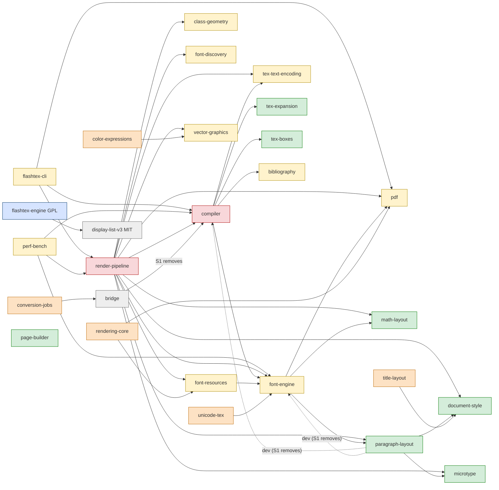

# Engine v2: P5 retirement plan (revision 3)

**Status:** a PROPOSAL for the Commander, lane P5-RETIREMENT. It is docs only and deletes no code. The Commander reassigned it from flashtex-2a to kabir-claude on 2026-10-06.
- Revision 3 answers the independent review of revision 2 (CHANGES-NEEDED, issue comment 5988954258): blocking items B1–B5, inventory gaps 1–7, the scope items and the smaller items. §9 maps each one.
- Revision 2 answered kabir-claude's NEEDS-FIX and mac-claude-a's NOT-READY reviews. §9 keeps that mapping.

**Governs:** nothing. [DESIGN.md](DESIGN.md) §3, §6.2, §10, §12 and §13 govern, and so does [modes/PROPOSAL.md](../modes/PROPOSAL.md) Q1. Where this plan and either of them disagree, they win.

**Measured on:** `origin/main` `317f1349d` (2026-10-06). Revision 2's numbers were taken on `412c918ec`. Everything that changed since is re-measured; the rest is marked as carried over.
- "VERIFIED": this lane checked it on that tree, with the commands in Appendix A.
- "REPORTED": quoted from DESIGN.md or a PR, not re-measured.
- "Belief": inferred.

**Authors:** flashtex-2a wrote revisions 1–2; kabir-claude (claude-opus-5-5) wrote revision 3.

---

## 0. Summary

**What changed since revision 2:**
- **S2 keeps `collaboration-core` (review B1).** The Mac `FlashTeXCollabCore` tests use it as their oracle, so S2 deletes **9** crates.
- **A pre-S6 move step, S6a (B2).** The v3 pane uses three pieces of v2 files: the `V2PageText` line builder, the URI policy in `DisplayListLinks` and the math hover view. S6a moves them into v3-owned files, as a rename with no behaviour change, before S6 deletes the rest.
- **The revert check can now fail (B3, §4.3).** It restores a stage's deleted paths on top of a tree that is newer than the stage, then runs the gates.
- **§5 describes the per-document choice as built (#1421, #1427), not as planned (B4).** S3 is "partly landed". What it still owes is S3r: per-engine capture features and engine labels in logs and tools.
- **Explicit rows per stage (B5, §4.4).** They come from the checklist of record, `docs/evidence/app-parity-2026-10-05/README.md` (#1564; it supersedes the 10-03 file). The rows are split into S5 rows (flip) and S6 rows (old route out).
  - **A9 is P5 scope through the Unicode mode** (DESIGN §13, decision 3A).
  - **The old engine stays the explicit fallback** for documents routed to Unicode until the Unicode mode's M3 gate (modes Q1, DESIGN §13 L1206). So **S6 and S7 wait for M3**.
- **The owner's rulings since 10-03 are applied.** Q3 confirmed the P5 bar (RQ17), Q1 named the T7 host (RQ18), and Q-new-1 / 3A brings A9 into P5 through the Unicode mode (RQ15 is superseded).
- **The stage statuses are current:**
  - S1 is done (#1400, `cba6c3470`).
  - S3 is partly landed (#1421, #1427).
  - S4 is partly in place:
    - (b) is #1461, with T4 on the board in #1598;
    - (c) the T2 harness was fixed by #1574;
    - (d) `notex-gate.yml` runs weekly (#1563);
    - (e) T7 is #1605 and #1609, from Q1.
  - D5's CLI successor exists as `flashtex-v3` (#1436).
- **Out of scope** (§5.8): the side-by-side compare, *Copy Engine Report*, the crash-limit banner and the storage UI. None is needed for retirement.

| | Count |
|---|---|
| §10-named crates retiring (compiler, render-pipeline): Rust src / tests | 162,689 / 84,589 (carried over from `412c918ec`) |
| S2 crates (no consumer, ruling 1): src / tests / other | **29,856 / 17,083 / 149,973 (9 crates, 1,142 files; VERIFIED)** |
| Crates orphaned by S7, plus the old CLI and perf-bench: src / tests | 82,946 / 17,262 (10 crates; carried over) |
| Kept as oracles, plus their 2 dependencies: src / tests | 40,993 / 17,135 (7 crates; carried over) |
| Swift retiring in S6, sources (§1.4) | 7,027 in 16 files, of which S6a first moves about 213 lines to v3 files (VERIFIED) |
| Workspace packages | 43: the 41 `crates/*` members, `tools/web2rust` and the implicit `flashtex-engine-build-id`. 34 after S2 (VERIFIED by reading the manifests; `cargo metadata` not run). |
| Open PRs touching old-engine crates | **0** (#1120 closed 2026-10-06; VERIFIED) |
| Stages | 12: S0 ✔, S1 ✔, S1b, S2, S3 (partly), S3r, S4 (partly), S5, S6a, S6, S7, S8 |

### Stage table

"Green" is defined in §4.1. The revert check (§4.3) is required for every stage that deletes code.

| # | Stage | What lands | Gate, beyond green | Owner | Revert check | Depends on | Status |
|---|---|---|---|---|---|---|---|
| 1 | **S0** vendor/ retired | #1183 (`e1e17d8f6`) | — | — | — | — | ✔ done |
| 2 | **S1** Decouple | #1400 (`cba6c3470`): paragraph-layout tests into compiler tests; bridge reads an MIT features table; the bundle verifier and its manifest move to `apps/mac/scripts/`; licence check E. `supported-latex.json` is excluded (RQ5). | No behaviour change | mac-claude-a | — | — | ✔ done |
| 3 | **S1b** S1 follow-ups | Check E's four false negatives, with CI running the boundary self-tests; a host field in the parity baseline (RQ8); remove the stale `crates/<crate>/target` probes in `ShellModel`; check `review-workflow.json`'s `/tmp/flashtex-compiler` path (§1.5); S1(c) **only after RQ5** | Same as S1 | Commander assigns | — | S1; RQ5 for S1(c) | not started |
| 4 | **S2** No-consumer cleanup (ruling 1) | Delete the 9 §1.2 crates, `tests/test_rendering_v2.py` and `scripts/check_rendering_v2.py`. Fix every live reference in the same PR: `gate.sh` L607–610, `rust-test-exclude.txt` L10, `SUPPLEMENTARY-FACES.json` L7, the `verify_bundle_resources.py` docstring, `docs/INDEX.md`, the `rendering-v2.schema.json` description and the root `Cargo.toml` count. Add a reference check with a named allowlist (§4.6). | `gate.sh pr`; CI green on both OSes; `packaging-selftest.sh` (fast); the §4.6 reference check finds nothing outside its allowlist | kabir-claude (P5-RETIREMENT) | **yes** | S1 ✔; #1120 closed ✔ | next |
| 5 | **S3** Per-document engine choice | #1421, #1427: the choice per document, a window override, the app setting, records, a lazy migration of the global key, fallback blockers with a banner | Built; `EngineChoiceTests` (29 tests) | mac-claude-a | — | — | **partly landed** |
| 6 | **S3r** S3 remainder | (a) `CaptureFeatures` per engine (§1.5); (b) an engine label on `FlashTeXLog` lines at open and compile, and an `engine` field in the §1.8 attribution tools | `mac-app`; named tests (§4.4) | kabir-claude | — | S3 | not started |
| 7 | **S4** Gates P5 needs | (a) the #1299 board on a hosted fallback leg, and a complete run; (b) T4 on the board (#1461 ✔ baseline FINAL; #1598 board row); (c) T2 completing green on main (#1574 fixed the harness); (d) the no-TeX-Live gate scheduled and green (#1563 ✔ weekly; first run pending); (e) T7 by Q1 (#1605, #1609; a reference run on main); (f) parity fixtures on the engine; (g) T0 in `CI required` ✔ (#1336); (h) **the row → test check** (§4.4) | 10 consecutive green `merge_group` runs with the new jobs; 3 consecutive complete nightly boards; one T7 reference run on main | Commander (workflows); (h) kabir-claude | — | — | partly |
| 8 | **S5** Flip: new documents default to the new engine | `EngineChoice.defaultForNewDocuments = .new` (EngineChoice.swift L130, one line); nightly `parity-corpus` and parity fixtures default to the engine; `baseline-fixtures.json` re-recorded on its host. **Existing documents do not change** (§5.3). | **Decision 3's gate as confirmed** (§4.2); the S5 rows (§4.4); one shipped release carries #1421/#1427's records (§5.3); T1 with 0 new differences; T7 meeting §1.2 | Commander (one-line flip) | — (flip back) | S3, S3r, S4 | — |
| 9 | **S6a** Shared types to v3 files | Move `V2PageText`'s line builder, `DisplayListLinks`'s URI policy and `MathHoverPreview`'s `padding` / `MathPreviewView` into v3-owned files (§1.4), as a rename with no behaviour change. Rewrite the v2-parity assertions in `EngineV3LinksTests`. | `swift build`; `EngineV3LinksTests`, `EngineV3AccessibilityTests`, `EngineV3SearchTests` and `EngineV3MathHoverTests` pass, not skipped | Commander assigns | — (a move) | S5 | — |
| 10 | **S6** App old route out | Delete the §1.4 Swift, the helper rows, menus, attach commands, user docs and the §5.5 defaults; retarget the tools (§1.8); remove the `.previous` engine, its blockers and banner from `EngineChoice` and rewrite their tests; `packaging-selftest.sh` must fail on a missing helper | **The S6 rows** (§4.4); the §6 licence preconditions (RQ19); RQ6 ruled; **the Unicode mode's M3 gate passed** (modes Q1) | Commander assigns | **yes** | S5, S6a, M3 | — |
| 11 | **S7** Old engine deleted at once | One PR deletes the compiler, render-pipeline, the old `flashtex-cli`, perf-bench and every §1.3 orphan, with their CI, scripts, generated entries and env (§1.7, §1.8) | Full tier; `check-generated.py`; a release.yml dry-run; the §4.6 check; T7 has gated for ≥ 10 runs; RQ5 ruled; 0 open old-path PRs | Commander assigns | **yes** | S6, queued as soon as it lands | — |
| 12 | **S8** Oracles to `tests/`, final sweep | Move the §2 crates to `tests/oracles/` (RQ4); `license` fields (R5); the `gate.sh` mapping; docs | Full tier; the §4.6 check | Commander assigns | **yes** | S7 | — |

### Owner decisions

| RQ | Question | State |
|---|---|---|
| RQ17 | P5 thresholds (Q3) | **Decided** 2026-10-05 (DESIGN §13 L1201): P-T2 ≥ 99 %, P-T1 ≥ 98 %, zero crashes on T4, new ≥ old on every tier. §4.2 applies it. |
| RQ18 | T7 reference host (Q1) | **Decided** 2026-10-05 (L1200): a manual T7 run on an idle, plugged-in Apple-Silicon Mac, plus a nightly non-blocking trend. `scripts/t7-reference.sh` is #1609. |
| RQ15 | Drop the `[fonts]` roles? | **Superseded** by Q-new-1 / 3A (L1202): the Unicode mode carries project and system fonts in P5. A9 is a P5 row (§4.4). |
| RQ19 | The §3 legal review and the source offer | Open; blocks S6 |
| RQ5 | Where `supported-latex.json` comes from | Open; blocks S1(c) and S7 |

### For the Commander: please confirm

1. **bibtex-bst leaves in S2** (RQ16). DESIGN §13 decision 4 (O4, L1162) ports `bibtex.web` through web2rust for the no-TeX-Live case. Nothing on main or in an open PR reuses `crates/bibtex-bst` (VERIFIED). The S2 PR deletes it in a commit of its own, which can be dropped.
2. **S6 and S7 wait for the Unicode mode's M3 gate** (modes Q1). This plan reads Q1 as: the old engine, and therefore the old route in the app, stays as the explicit fallback for Unicode-routed documents until M3 passes. S6 and S7 come after M3.
3. **The S5 / S6 row split** in §4.4. Visible-fallback rows (A9, A17) are allowed at S5 and forbidden at S6. Old-route-only rows (B9, C25, E2, E3, E5) gate S6, not S5.
4. **"Gates, not a soak"** (revision 2's question): S4's three consecutive boards and S5's T7 requirement are gates. Q1 and Q3 being decided removes their dependency on an open question.
5. **Ruling 4 at S6** (§5.3): a document still recorded as `previous` gets a one-time sheet that must be acknowledged.
6. **§10's TFM wording** (§2): only `math-layout/src/tfm.rs` survives, in place.
7. **The Commander's open RQs:** RQ3, RQ6, RQ7 and RQ10 (§7).

---

## 1. Inventory of what retires

LOC is the newline count over tracked files. "src" is `*.rs` outside `tests/`, `benches/`
and `examples/`; "tests" is `*.rs` under them; "other" is every other text file
(Appendix A.1).

### 1.1 Crates named by §10

| Path | Rust src | Rust tests | Other | Files (bin) | §10 reason |
|---|---:|---:|---:|---:|---|
| `crates/compiler` | 89,157 | 39,547 | 65,471 | 754 (28) | Hand parser, package ports, the marker hand-off, and Appendix G copy #1 (`src/math.rs`) |
| `crates/render-pipeline` | 73,532 | 45,042 | 253,430 | 1,392 (52) | Adapter, typeset paths, the page-builder copy, and Appendix G copy #2 (`math*.rs`); TFM reader `src/tfm.rs` (280) |
| `crates/render-pipeline/vendor/` | — | — | — | — | Already retired (S0, #1183) |
| **Subtotal** | **162,689** | **84,589** | **318,901** | 2,146 (80) | |

"The three math layout copies" are copy #1 in the compiler, copy #2 in render-pipeline, and
copy #3 in `crates/math-layout`, which §10 keeps as an oracle. This plan reads §10 as
retiring copies #1 and #2 only (RQ3).

### 1.2 Crates with no consumer anywhere (S2, ruling 1)

**What qualifies.** A crate qualifies when it has none of:
- a Cargo reverse dependency, normal or dev, in any of the 60 tracked `Cargo.toml` files (including apps/, typst-host, tools/ and the excluded `crates/flashtex-xetex`);
- a binary that an app bundles or spawns;
- a CI or script invocation;
- a path reference from Swift, including `#filePath` patterns (Appendix A.2, A.4).

The Commander ruled that the derived list stands (RQ1). Revision 2's tenth crate, `collaboration-core`, fails the test and **stays** (review B1). The Live Share P0 (`d3f7f22dd`, `44552db11`) made it the oracle of the Mac `FlashTeXCollabCore` module:
- `apps/mac/Tests/FlashTeXCollabCoreTests/FixtureTests.swift` L19–22 reads its `tests/fixtures/collab-v1` through `#filePath`;
- `apps/mac/Package.swift` L68 names it;
- `docs/contracts/collab-v1.md` L9–11 and L213–232 name it.

It is not old-engine code.

VERIFIED on `317f1349d`: `git ls-files` and `wc -l`; "other" counts every non-`.rs` file.

| Path (package) | src | tests | Other | References outside the crate, excluding docs/evidence and coordination |
|---|---:|---:|---:|---|
| `crates/bibtex-bst` (`flashtex-bibtex-bst`) | 5,380 | 118 | 35,125 | `reviews/2026-09-30/track-2-app.md` L47, L649 (history). Deleted per RQ16; see "For the Commander". |
| `crates/color-expressions` | 1,375 | 0 | 13 | `docs/proposals/generated-data-and-maintainability.md` L499 |
| `crates/conversion-jobs` | 2,660 | 2,176 | 333 | `docs/INDEX.md` L84–85. Its `flashtex-review-inbox` binary needs a feature nothing enables, and nothing bundles it. |
| `crates/project-bundle` | 1,205 | 1,799 | 17 | none |
| `crates/rendering-core` | 11,684 | 10,334 | 97,495 | **Live:** `scripts/gate.sh` L607–610 (`cmp` of the native-assets manifest with its copy in this crate), `scripts/rust-test-exclude.txt` L10, `apps/mac/Fonts/SUPPLEMENTARY-FACES.json` L7 (provenance text), the `apps/mac/scripts/verify_bundle_resources.py` docstring L8–10, `docs/INDEX.md` L90–91. **Comments in code that S6 or S7 deletes:** pdf, render-pipeline, font-resources, paragraph-layout, `RenderingV2*.swift` and their tests (§4.6 allowlist). Its 15 examples are built only by `--workspace --all-targets`. |
| `crates/spellcheck` | 1,379 | 778 | 13 | `generated-data-and-maintainability.md` L500. `LaTeXSpellCheck.swift` L5 names a lane, not this crate. |
| `crates/title-layout` | 777 | 729 | 13 | Comments in compiler, which S7 deletes: `layout.rs` L2671, `parser.rs` L1341, `tests/maketitle.rs` L4 (§4.6 allowlist); `generated-data-and-maintainability.md` L499 |
| `crates/toc-layout` | 778 | 537 | 12 | `generated-data-and-maintainability.md` L499 |
| `crates/unicode-tex` | 4,618 | 612 | 16,952 | `generated-data-and-maintainability.md` L104, L221, L499 |
| **Total (9)** | **29,856** | **17,083** | **149,973** | 1,142 files |

**Facts S2 relies on** (VERIFIED):
- No workflow names any of the nine.
- None is in `HELPER_TABLE` (`make-app.sh` L79–92), `build-helpers.sh` `HELPERS` (L52–60) or `release.yml`.
- No open PR touches them.
- `scripts/clippy-debt.txt` has been empty since #1401, so revision 2's "edit clippy-debt" items are dropped (gap 4).
- After S2 deletes `rust-test-exclude.txt` L10, the list is empty. `nightly.yml` L686 tests each listed package, so the line must go in the same PR.

S2 also deletes `tests/test_rendering_v2.py` and the script it imports, `scripts/check_rendering_v2.py`. No CI or gate step runs either one. The description in `protocol/rendering-v2.schema.json` L5 names that script, so S2 rewords it. The schema itself stays until S7, because pdf and render-pipeline still read it.

`gate.sh`'s stray-directory check (L554–572) fails on a `crates/*/` directory without a `Cargo.toml`. A local `target/` left behind in a deleted crate trips it. S2's PR body says so.

### 1.3 Crates orphaned once §1.1 goes (S7)

The Commander ruled that these retire (RQ2). Their only reverse dependencies are crates
that are themselves retiring.

| Path | src | tests | Other | Reverse dependencies today | Note |
|---|---:|---:|---:|---|---|
| `crates/flashtex-cli` | 3,602 | 1,381 | 34 | none (bundled; release.yml ships it) | Its successor is #1436's `flashtex-v3` (`crates/flashtex-build`, MIT, which stays); the rename to `flashtex` and the packaging are RQ6 |
| `crates/perf-bench` | 3,559 | 0 | 770 | none (perf.yml) | Replaced by T7. Deleted only after T7 gates (§4.5). |
| `crates/class-geometry` | 6,031 | 2,125 | 5,797 | render-pipeline | |
| `crates/font-discovery` | 1,215 | 0 | 15 | render-pipeline | |
| `crates/vector-graphics` | 9,625 | 1,429 | 401 | render-pipeline, color-expressions | |
| `crates/bibliography` | 3,729 | 718 | 438 | compiler | |
| `crates/pdf` | 16,951 | 5,344 | 6,163 | cli, font-engine, render-pipeline, rendering-core | `flashtex-pdf-exact` is the old export route until S6 |
| `crates/font-engine` | 20,755 | 1,946 | 4,311 | compiler, font-resources, perf-bench, render-pipeline, unicode-tex; dev: paragraph-layout (removed by S1), rendering-core | |
| `crates/font-resources` | 13,757 | 4,089 | 4,809 | render-pipeline, rendering-core | Its TFM reader retires with it (§2) |
| `crates/tex-text-encoding` | 3,722 | 230 | 43,670 | compiler, render-pipeline | Its TFM reader retires with it (§2) |
| **Subtotal** | **82,946** | **17,262** | **66,408** | | 376 files (50 binary) |

**Not retiring:** `crates/bridge`. S1 removes its compiler dependency: `features.rs` L12
imports `COMMAND_GLYPHS`, and the test module at L36–40 imports
`diagnostics::Diagnostic`, `lexer::tokenize` and `math::{parse_tokens, MathList,
MathPackages}`. Its feature list goes to the conversion model for iPad captures, so it
is a user-visible contract. #1400 keeps it byte-identical (193 entries), and the
transfer protocol does not change.

The IDE crates stay: preview-controller, document-runtime, project-index, edit-ledger,
project-files, project-manifest, package-resolver and docstrip. RQ7 covers
preview-controller once its runtime-v1 producer is gone.

### 1.4 apps/mac (Swift)

DESIGN §6.2 says the v2 path (`V2PreparedPage` → `GlyphRunRenderer` → `V2PageRasterizer`) "is the old engine's pane and retires at P5". The v3 pane draws with `DL3Renderer`. So the v2 and v1 panes **retire**. Nothing in them is adapted, **except three small pieces the v3 pane already uses** (review B2). S6a moves those first.

**S6a: move into v3-owned files first** (VERIFIED; a rename with no behaviour change):

| From | What moves (lines on `317f1349d`) | v3 users |
|---|---|---|
| `FlashTeXMac/PreviewV2Accessibility.swift` | The `V2PageText` core: `Word`, `Line`, `wordGapEm` (L17–73), `Cluster` and its constants (L111–128), `lines(words:rules:)`, `pageLabel`, `elidedPageLabel`, `lineLabel` (L135–271). About 213 LOC. The `RenderingV2.SourceRange` in `Word`/`Line` becomes `RuntimeV1.SourceRange`, its typealias target. `words(of:)`, `rules(of:)` and `lines(of:)` take `RenderingV2.Page`, so they stay and go with the file. | `EngineV3Accessibility.swift` L194–320, `EngineV3Preview.swift` L255 |
| `FlashTeXMac/DisplayListLinks.swift` | The URI policy: `allowedURISchemes` (L10–12), `allowedURL` (L62–67), `openURL` (L86–88). About 11 LOC. The rest is v2-only (it uses `V2Live` and `RenderingV2.Navigation`). | `EngineV3Links.swift` L45, L99 |
| `FlashTeXMac/MathHoverPreview.swift` | `padding` (L28–29), `MathPreviewView` and the hover-controller extension (L101–122). About 25 LOC; the rest (L16–27, L30–99) is v2 (`V2Frame`, `V2Geometry`, `V2PageRasterizer`). | `EngineV3MathHover.swift` L59; `EditorIntelligence.swift` L836 |

Two corrections to the review's list:
- **`PreviewAXElement` needs no move.** It is defined in `FlashTeXAccessibility/AccessibilityViews.swift` L161, which stays.
- **`CaretFollow.swift`'s v2 uses are old-path branches, so they are deleted in S6, not moved:**
  - L300–302, the `previewV2` branch;
  - `caretTarget(byte:path:in: V2Frame)` at L305–332;
  - `points(_: RenderingV2.Rect)` at L351–354.

  `CaretFollow.Target` (L51) stays.

`EngineV3LinksTests` checks v3 against v2 at L41, L56–63 and L121–126 (`DisplayListLinks.action/.hit/.tooltip`, the `DisplayListLinksTests` fixtures, `model.activatePreviewLink`). S6a rewrites those assertions against fixed expectations.

**Retire outright in S6** (VERIFIED sizes):

| Path (`apps/mac/Sources/`) | LOC | What it is |
|---|---:|---|
| `FlashTeXMac/PreviewV2View.swift` (contains `V2PageRasterizer`, L631) | 1,490 | The v2 pane |
| `FlashTeXMac/GlyphRunRenderer.swift` | 618 | The v2 glyph renderer, `V2Frame`, `V2Geometry`, `V2FontStore` |
| `FlashTeXMac/PreviewV2Accessibility.swift` | 419 (about 206 after S6a) | v2 VoiceOver text |
| `FlashTeXMac/V2PageCache.swift` | 176 | v2 page cache |
| `FlashTeXMac/V2ImageStore.swift` | 171 | v2 images (missing from revision 2, gap B2) |
| `FlashTeXMac/V2PathGeometry.swift` | 115 | v2 paths (missing from revision 2) |
| `FlashTeXMac/PreviewView.swift` | 210 | The v1 pane |
| `FlashTeXProtocol/RenderingV2.swift`, `RenderingV2Fast.swift` | 1,102 + 1,229 | v2 decoders |
| `FlashTeXMac/DisplayListDelta.swift` | 433 | `display-list-v2-delta` |
| `FlashTeXMac/V2PageWindow.swift` | 204 | v2 window negotiation |
| `FlashTeXMac/WholeDocumentList.swift` | 210 | Whole v2 list for the old export and print |
| `FlashTeXMac/BundledMetrics.swift` | 155 | `FLASHTEX_TFM_DIRS` for flashtex-render |
| `FlashTeXProtocol/LayoutNegotiation.swift` | 74 | `FLASHTEX_LAYOUT_CAPABILITIES` |
| `FlashTeXMac/WorkerClient.swift` | 172 | The runtime-v1 worker |
| `FlashTeXMac/MathCaretHighlight.swift` | 249 | An extension on `V2Geometry`; its `caretFormulaBoxes` has no caller outside v2 |
| **Sources** | **7,027** | before S6a moves about 213 lines out |

**Old-path code to trim in files that stay** (VERIFIED callers; each stops compiling once the files above go):
- **`ShellModel.swift`:** `locateRenderPipeline`, `locateCompiler`, `locateDefaultProducer`, `attachDiscovered*`, `activatePreviewLink` (L586–596), and the uses of `LayoutNegotiation`, `DisplayListDelta`, `V2PreviewState`, `V2Window`, `V2Live`, `WorkerClient`, `RenderingV2` and `receiveDisplayListV2`. Also `FLASHTEX_PREVIEW_V2` and `FLASHTEX_LAYOUT_CAPABILITIES`.
- **`ShellModel+DisplayCandidates.swift`:** L120, L388–401, L714–824.
- **`ContentView.swift`:** L210–213, L343 (`PreviewV2Pane`), L346 (`PreviewView`).
- **`SourceEditorView.swift`:** L130, L811–815.
- **Single sites:** `Navigation.swift` L699, `FlashTeXMacApp.swift` L319, `TitleBar.swift` L43.
- **Export and print:**
  - `ExactPDFExport.swift` L120–180, the `flashtex-pdf-exact from-v2` route and `FLASHTEX_PDF_EXACT`. Its v3 branch stays, and so does `ExportSession`'s publish step, which #1343's `startExternal`/`finishExternal` uses.
  - `PrintController.swift` L85–90.
- **`PreviewAnnouncements.swift`:** L96, L100, L125, L167, L184.
- **`ProposalPreview.swift`:** L116, L231, L273. This is the worker-based proposal preview, row E3.
- **Waiting on RQ7:** `PreviewControllerClient.swift` L165, `HistoricalPreview.swift` L431, `ShellModel+Controller.swift` L538.
- **`AccessibilityCommands.swift`:** L102–109, `attachBuiltCompiler` (⌘⇧K) and `attachRenderPipeline` (⌘⇧R), with their menu items and palette entries (`CommandPalette.swift` L99–100). The `"PreviewView("` marker string at L497 is checked against `CommandTableTests`.
- **`EngineChoice.swift`:** the `.previous` engine, the `noTeXLive`, `projectFonts` and `bundleDeclined` blockers, `EngineFallbackBanner` (L740–771) and the Settings text (L812). With them go `EngineChoiceTests`' fallback assertions:
  - L104, L115, L165, L181, L197–200, L290–291, L417, L516–518, L554, L647;
  - these are rewritten to assert that only the new engine resolves (gap 6).

**Tests retiring:** `PreviewV2Tests`, `LayoutCapabilityConsumerTests`, `V2ImageTests`, `RenderingV2Tests`, `V2ConformanceTests`, `BundledMetricsTests`, `V2WindowTests`, `DisplayListDeltaTests`, `V2PathTests` and `V2FontStoreIdentityTests`. `RealCompilerTests` is retargeted to the host. `ExactPDFExportTests` shrinks. `PreviewFontSmoothingTests` loses its `V2PageRasterizer` cases (L24, L75, L88).

**Waits on RQ7** (the preview-controller route; row E5): `PreviewControllerClient` 424, `ShellModel+Controller` 666, `ShellModel+DisplayCandidates` 836, `HistoricalPreview` 472, and `HistoricalPreviewTests` 554. These are revision 2's sizes.

**Shrinks:**
- `RuntimeV1.swift` (791) keeps what diagnostics and `SourceRange` need.
- `Fonts.swift` and `ProjectFonts.swift` keep what the Unicode mode needs for `[fonts]`. RQ15 is superseded by 3A.

**Bundle and helpers** (carried over from revision 2, which re-checked them at `412c918ec`):
- `apps/mac/Fonts/` feeds flashtex-render and the `FLASHTEX_{FONT,TFM,LM}_DIRS` environment in `gate.sh` L132–134 and in ci.yml `rust-workspace` and `rust-standalone`. It goes in S7, unless the no-TeX-Live bundle reuses it.
- `make-app.sh` `HELPER_TABLE` and `build-helpers.sh` `HELPERS`: the rows `cli`, `compiler`, `pdf`, `render` and `pdf_exact` leave in S6. So does the `explain` row, which names a crate that does not exist. The host is built separately.
- `launch-check.sh` (`COMPILER_IN_BUNDLE`, `RENDER_IN_BUNDLE`) and `faces-acceptance.py`, which require bundled `flashtex-render` and `flashtex-pdf-exact`, are retargeted to the host in S6.
- `packaging-selftest.sh` **skips** texmf-acceptance when `flashtex-render` is absent, so S6's gate would pass vacuously. S6 retargets that check to `flashtex-host` and makes a missing helper **fail**.
- User docs: `docs/user/gui.md` and `docs/user/README.md`, for the attach commands.

### 1.5 apps/ios

The iPad companion has no engine code (D14), and no iPad Swift retires.
- `supported-latex.json` exists in three identical copies (1,530 lines; sha256 `2e121907…`): `crates/compiler/supported/`, `apps/mac/Sources/FlashTeXMac/Resources/` and `apps/ios/FlashTeXPad/Resources/`. `sync-supported-latex.sh` regenerates it from the compiler (L39, L45), and CI checks it in ci.yml L481 (`inventory`) and L964 (`mac-app`). S7 removes the source, so **RQ5 must be ruled before S7**. Until then the iPad copy is a static file and keeps working.
- `apps/ios/FlashTeXPad/Resources/review-workflow.json` L7 names a `/tmp/flashtex-compiler…`
  path. The file is loaded by `PadModel.swift` and `FlashTeXPadKit/ReviewedProposal.swift`.
  S1b checks whether the path field is used. If it is not, S1b removes the field;
  otherwise S6 retargets it. Either way the iPad build stays free of engine code.
- The bridge feature list (§1.3) is another compiler-derived input to the iPad capture
  flow. S1 keeps it byte-identical.
- **`apps/mac/Sources/FlashTeXMac/CaptureFeatures.swift`** (81 lines, MIT) is the Mac's own pinned `supported_features` list. It is sent with every `capture_convert` (transfer-v1), and the bridge forwards it to the conversion provider.
  - **What it holds:** the 60 `COMMAND_GLYPHS` names and the parser's structures, pinned to compiler commit `49e6eb43…` (`compilerSHA`, L18). It also has explicit "NOT supported" lines (L50–56: `gather*`, `\mathbb`, `\text`), which describe the **old** compiler's limits.
  - **It has no engine parameter.** Its callers (VERIFIED) are `ShellModel+Bridge.swift` L309 (`submitCapture`) and L349 (`convertCapture`, default argument), which L344 and `CaptureInbox.swift` L218 reach without an override. So a document on the new engine still advertises the old compiler's limits.
  - **Its test:** `CaptureFeaturesTests` re-derives the glyph list through `git show <sha>:crates/compiler/src/math.rs` and skips when that commit is absent.

  | Stage | What happens to it |
  |---|---|
  | S3r | `supportedFeatures(for: Engine)`. A capture for a document on the new engine sends a list without the old "NOT supported" lines for features the new engine typesets. The old-engine list stays byte-identical. The new list is MIT data; its provenance follows RQ5's ruling, and until then it is the old list minus the `unsupported` block. Tests: `CaptureFeaturesTests.testTheNewEngineListOmitsTheOldLimits` and `testTheOldEngineListIsUnchanged`, plus a `ShellModel+Bridge` test that the document's engine picks the list. |
  | S6 | The old list and the git-history test retire. One list remains, with a test that pins it to its MIT source. |
  | S7 | Nothing left to do. |

### 1.6 Tests outside the retiring crates

| Path | Action |
|---|---|
| paragraph-layout `tests/{adversarial,mismatch_fixtures,hyphenation_spans}.rs` (983 LOC) | Moved into compiler tests by S1 (#1400) |
| `#[ignore]`d tests pinned to `FLASHTEX_TEST_COMPILER`: `bridge/tests/proposal_validation.rs` L134–137, `document-runtime/tests/session.rs` L134–136, `preview-controller/tests/lifecycle.rs` L186–188, `preview-controller/tests/stdio.rs` L586–588 and L1051–1053 (plus the two crates' README mentions) | Retargeted to the host or deleted in S7. They don't break CI today because they are ignored, but they would rot silently. |
| `tests/test_rendering_v2.py` → `scripts/check_rendering_v2.py` | S2 |
| `font-resources/tests/{tfm_consumer,required_tfm}.rs` (`tfm_consumer` reads `font-engine/fixtures/tfm/ec-lmr10.tfm` through `include_bytes!`) | Retire with font-resources in S7 (§2) |

### 1.7 CI (`.github/workflows`)

| Job | Today (VERIFIED) | Action |
|---|---|---|
| `ci-required` needs (ci.yml L1099–1120) | plan, build, quick, boundary, inventory, gates, parity-fixtures[-hosted], engine-parity[-hosted], rust-workspace, rust-standalone, trip, etrip, pdftex-regression, mac-app, ipad | S7: remove `rust-standalone` and, once its engine kind is the only one, the old parity-fixtures condition (L1142–1148) |
| `rust-standalone` (L788–821), matrix render-pipeline and flashtex-cli | Builds and tests in `crates/<crate>` with the apps/mac/Fonts env | S7 |
| `inventory` (L470–487) | `sync-supported-latex.sh --check` | Repointed when RQ5 is ruled (S1b), and before S7 |
| `gates`: Core-14 step (L505–521, `fetch-glyphlist.sh`) | font-engine | S7 |
| `parity-fixtures` / `-hosted` (L543–594), run only for old-engine changes (#1298, plan L298–308) | Builds flashtex-cli (`action.yml` L23–34) | S4(f): add the engine kind. S7: drop the cli kind and the `old_engine_crates` list. |
| `engine-parity` / `-hosted` (L595–709) | The new engine's P-T1/P-T2 fixtures, `FLASHTEX_REQUIRE_TEXLIVE=1` | Unchanged |
| nightly `parity-corpus` (L117–206) | v1: builds flashtex-cli (L144, L169) | S5: default to the engine. S7: drop the v1 build. |
| nightly `corpus-t4` (L253–378) | New engine only; **no v1 leg** | S4(b) |
| nightly L504, L565–566, L613 | Loop over render-pipeline and flashtex-cli | S7 |
| `p5-scoreboard.yml` | Self-hosted NixOS only; `scoreboard-unavailable` just prints a notice; downloads a `corpus-t4-v1` artifact that nothing produces (L141–142) | S4(a), S4(b) |
| perf.yml `bench` | perf-bench over the old path | Dual-run with T7 from S4; deleted in S7 after T7 has gated |
| release.yml | `build-helpers.sh`, `package-cli.sh`, and smoke tests of `flashtex` and `flashtex-render` | S7: engine distribution and source archive (§6, RQ6) |
| `trip`, `etrip`, `pdftex-regression` | Required since #1336 | Unchanged |

### 1.8 Scripts and tools

| Path | Action and stage |
|---|---|
| `scripts/gate.sh` L427–428 `gate_parity_fixtures` (builds flashtex-cli); L463–472 `standalone_profile` | S4(f) adds the engine kind; S7 drops the cli kind and `standalone_profile` |
| `scripts/gate.sh` L132–134: `FLASHTEX_FONT_DIRS`, `FLASHTEX_TFM_DIRS` and `FLASHTEX_LM_DIR` → `apps/mac/Fonts` | S7, with apps/mac/Fonts, after checking the document-runtime and preview-controller tests (A.5) |
| `.github/actions/parity-fixtures/action.yml` L23–34, L48 | S4(f), then S7 |
| `tools/parity/parity.py` L113 `DEFAULT_FLASHTEX`; L1841–1843 `--engine` and `--engine-kind {auto,flashtex-cli,tex}` | S5: the default becomes the engine; S7: the `flashtex-cli` kind is dropped |
| `apps/mac/scripts/{bundle-texmf.py, launch-check.sh, texmf-acceptance.sh}` (verifier callers) | Repointed in S1 (#1400) |
| `apps/mac/scripts/{launch-check.sh L190–198, faces-acceptance.py L43–44, packaging-selftest.sh L194–202}` | S6 (§1.4) |
| `scripts/ci/build-helpers.sh`, `make-app.sh` `HELPER_TABLE` | S6 |
| `scripts/ci/package-cli.sh` | S7 (RQ6) |
| `scripts/ci/fetch-glyphlist.sh`, `scripts/render-corpus-v2.sh`, `tools/font-metric-sweep`, `tools/kernel-math-gap` | S7 |
| `scripts/caret_context_oracle.py` (`--flashtex` default is flashtex-render) | S6: retarget to the host |
| Old-path attribution: `tools/native-validation/mac-live/lib/typing_attribution.py` (L9–15, L328–348), `launch_summary.py` L58, `capture_cycle.py` (L122, L317–318), `tools/typing-bench/evidence.py` (L49–54, L143), and the `FlashTeXLog` prefixes `preview-v2:`, `compile:`, `display-candidate:`, `worker:` and `paint:` | S3 adds an engine label; S6 drops the old routes (§5.6) |
| `Cargo.toml` L11–14 (the comment on live siblings) and L23–29 (the `[profile.release]` pin "because perf-bench's committed baselines state the build profile") | S7 rewrites the L23–29 reason for the T7 bench's baselines and deletes L11–14 |
| `scripts/generated-manifest.json` (15 entries) | S7: compiler 8, font-engine 2, tex-text-encoding 2. math-layout's 3 stay. |
| `scripts/clippy-debt.txt` (empty since #1401) and `rust-test-exclude.txt` (rendering-core only) | S2 removes rendering-core's line; nothing else to do |
| `tools/real-world-corpus`, `tools/visual-oracle`, `tools/typing-bench`, `tools/native-validation` | S6: retarget to the host. `native-validation/mac-live/reports/` is evidence and stays. |
| `tools/parity`, `lockstep`, `latex-suites`, `incr-bench`, `web2rust`, `displaylist`, `snapshot-bench` | Kept |

### 1.9 Docs and generated data

These are unchanged from revision 1.
- **Retire** with the code they describe:
  - `docs/proposals/{display-list-v2-delta, node-stream-inventory, font-system-math, packages-fonts-manifest, pdf-searchable-text, rendering-abi, contract-draft-review-ad922ea}.md`
  - `docs/contracts/{runtime-v1-layout-capabilities, rendering-v2-proposal}.md`
  - `docs/resources/ft005-duplication.md`
  - `docs/handoffs/paragraph-layout-forced-break/`
- **Rewrite:** `docs/user/compiler.md`, for the CLI successor; `docs/user/project-manifest.md` `[fonts]`, per RQ15.
- **Keep:** `docs/evidence/` (append-only), and `docs/contracts/runtime-v1*.md` until RQ7 is decided.
- **Generated data:** the compiler, font-engine and tex-text-encoding tables go with their crates.
- **Re-recorded:** `tools/parity/baseline-fixtures.json` (S5). perf-bench's baseline is deleted, not re-recorded (§4.5).

### 1.10 Saved user data, defaults and environment (VERIFIED)

| Item | Where | Rule |
|---|---|---|
| Edit ledgers | `Application Support/FlashTeX/ledgers/<sha16>` (`ShellModel+Controller.swift` L65–68), written only by the preview-controller route (#1337 E5) | §5.5 |
| Review history | `Application Support/FlashTeX/review-history/<id>.json` (`ReviewHistory.swift` L107–118) | Engine-neutral review decisions; kept as is |
| `HistoricalPreview` | In memory only (L442), so nothing persists | Goes with RQ7 |
| Captures, dirty snapshots, pairing, themes | Application Support | Engine-neutral; untouched |
| v3 output | `~/Library/Caches/FlashTeX/engine-v3/projects/<hash>-<pid>-<n>/{src,out}` (`EngineV3Host.swift` L109–115; `EngineV3Session.swift` L1401) | Unchanged; nothing is written into the project (§5.4) |
| Defaults removed in S6 | `FlashTeX.EngineV3.enabled` (`EngineV3Host.swift` L18) and `.legacyMigrated.v1` (§5.5); `FlashTeX.Preview.v1.debugStatus` (`ShellModel.swift` L146) | One-time migration with a test (§5.5) |
| Defaults kept | `FlashTeX.EngineV3.documents`, `.defaultEngine` (§5.1), `FlashTeX.EngineV3.hostPath`, `.trustRecords.v2`, `FlashTeX.Preview.fontSmoothing`, `FlashTeX.PreviewZoom.v1` | v3 uses them |
| Environment removed in S6 | `FLASHTEX_PREVIEW_V2`, `FLASHTEX_LAYOUT_CAPABILITIES`, `FLASHTEX_PDF_EXACT`, `FLASHTEX_COMPILER` | |
| Environment kept | `FLASHTEX_ENGINE_V3` (§5.2), `FLASHTEX_HOST`, `FLASHTEX_V3_CACHE` | |

---

## 2. Kept as oracles and tests (§10, ruling 2)

| Crate | src / tests / other | Consumers after S7 | Moves in S8 |
|---|---|---|---|
| tex-expansion | 12,908 / 3,836 / 4,218 | its own tests; a T6 expander oracle | → `tests/oracles/` |
| tex-boxes | 3,655 / 1,146 / 4,326 | its own tests; a T6 box-builder oracle | → `tests/oracles/` |
| paragraph-layout | 6,649 / 5,914 / 41,200 | its own tests (no compiler dev-dependency after S1) | → `tests/oracles/`, with **document-style** (2,323 src) and **microtype** (1,678 src), its normal dependencies, kept only for that reason |
| math-layout | 11,394 / 3,518 / 1,771 | its own tests. Today its only Cargo consumers are font-engine and render-pipeline, both retiring. | → `tests/oracles/` |
| page-builder | 2,386 / 245 / 105,214 | its own tests and `oracle/fixtures` | → `tests/oracles/` |

**TFM readers (ruling 2).** None of the kept crates depends, by Cargo or in code, on
tex-text-encoding, font-resources or render-pipeline's TFM code (VERIFIED). The only hit
is a doc comment at `microtype/src/lib.rs` L15.
- **Survives:** `math-layout/src/tfm.rs` (187 LOC). It is `pub mod tfm` (lib.rs L26), and math-layout's own `cm.rs`, `ams.rs`, its generated `cm_tfm.rs`/`ams_tfm.rs` and `tests/math_font_kerns.rs` use it. It is the only TFM reader a kept crate depends on. It **stays where it is**, inside math-layout, and is neither moved nor extracted. If an engine-side differential test needs it, it uses math-layout's existing public module (GPL → MIT, allowed).
- **Retire with their crates in S7:** `tex-text-encoding/src/tfm.rs` (287), `font-resources/src/tfm.rs` (680, plus `required_tfm.rs` and `tfm_run.rs`, and the tests `tfm_consumer.rs` and `required_tfm.rs`) and `render-pipeline/src/tfm.rs` (280). Revision 1's `tests/oracles/tfm-readers` crate is withdrawn.
- **The engine's own TFM loader** is tex.web's `read_font_info` (`flashtex-engine/src/generated/body_3.rs` L3071). The T6 TFM parser fuzzer compares it with math-layout's reader.
- The Commander amends §10's "the TFM readers" to match. This plan does not edit DESIGN.md.

**Why move the oracles under `tests/`** (RQ4, ruled: move): it makes the product/oracle
split visible and keeps the oracles out of the §14 "unused crates" metric. **Cost:**
`members` gains `"tests/oracles/*"`, and the `gate.sh` path→package mapping and the
ci.yml `plan` filters learn the new root. **Licence:** the oracles stay MIT and never
depend on flashtex-engine; check A enforces this.

---

## 3. Dependency graph

### 3.1 Cargo

Path dependencies from `cargo metadata --no-deps` (42 packages at `412c918ec`; 43 now with `flashtex-build` and the implicit `flashtex-engine-build-id`; collaboration-core, flashtex-build and the engine's crates are not drawn); `-.->` marks a dev
dependency. This is unchanged from revision 1 except for the edges S1 removes, which are
marked "S1".

**Reverse dependencies that block a deletion:**
- compiler ← bridge and paragraph-layout (both removed by S1), flashtex-cli, perf-bench, render-pipeline;
- render-pipeline ← flashtex-cli, perf-bench;
- font-engine ← font-resources, unicode-tex, perf-bench, rendering-core (dev);
- pdf ← font-engine, rendering-core, flashtex-cli.

S7 deletes them all in one PR, so the order inside S7 does not matter.

### 3.2 Non-Cargo edges

- **Mac app → binaries** (spawned, never linked): `flashtex-render`, `flashtex-compiler`,
  `flashtex-pdf-exact` and `flashtex-preview-controller` (old route, out in S6),
  `flashtex-bridge` (stays) and `flashtex-host` (the new engine).
- **iPad → data:** `supported-latex.json`, and indirectly the bridge feature list.
- **CI and scripts → crates:** §1.7 and §1.8.

### 3.3 MIT→GPL edges the switch-over could tempt (§3 forbids every one)

There are none today. Check A covers Cargo, check B covers apps/ios, and #1400's check E
covers apps/mac.

| Tempting edge | Safe route |
|---|---|
| CLI → engine | A GPL CLI next to `flashtex-host`, or an MIT CLI that spawns the host over display-list-v3 (RQ6) |
| T7 bench → engine internals | The bench on the GPL side, or driving the host over the socket |
| preview-controller → engine | It spawns `flashtex-host` (RQ7) |
| bridge → engine data | An MIT table (S1) |
| `supported-latex.json` generated from engine code | Forbidden for the iPad (§3); RQ5 |
| apps/mac linking a Rust static library | Refused by check E (E1–E4) |
| oracle → engine | Differential tests live on the engine side (GPL → MIT) |

---

## 4. Stages

### 4.1 "Green"

- `scripts/gate.sh pr` passes before the push (on the PC, or on a Mac for apps/).
- **`CI required` passes.** Its needs on main are:
  - plan, build, quick, boundary, inventory, gates;
  - parity-fixtures[-hosted], engine-parity[-hosted];
  - rust-workspace, rust-standalone;
  - **trip, etrip and pdftex-regression** (required since #1336);
  - mac-app and ipad.

  In a merge queue, one `engine-parity` leg must succeed. Revision 2 verified this list; it is carried over.
- perf.yml `engine performance` passes until S7. T7 gates from S4(e) on, by Q1's manual reference run.

### 4.2 Decision 3's gate, as confirmed (S5)

The owner confirmed the P5 bar on 2026-10-05 (Q3, DESIGN §13 L1201). S5 lands only when all of these hold **on one SHA**:

1. **The #1299 scoreboard is all green on a complete nightly run**: no partial or missing row, and new ≥ old on every tier, including T4 (#1598 adds the T4 row).
2. **P-T2 ≥ 99 % and P-T1 ≥ 98 %** of measured documents on the arXiv and T4 tiers.
3. **Zero crashes on T4** (the 5k corpus).
4. Decision 3's own items (L1161), which the Q3 confirmation does not repeat. This plan keeps them **until the owner says otherwise**:
   - T2 with 0 unexpected failures;
   - the no-TeX-Live gate green (`notex-gate.yml`, weekly since #1563);
   - **the S5 rows** of §4.4.

This plan adds three items:
- **T1 has 0 new differences** (P4 before P5);
- **T7 meets §1.2** on a Q1 reference run (`scripts/t7-reference.sh`, #1609);
- **one shipped release carries #1421/#1427's records** (§5.3).

**Status** (REPORTED, DESIGN §12 and reviews/2026-10-05; not re-measured):
- The parity numbers are met on lane-run evidence.
- The official board's latest scheduled run on main (37331608247, 10-05) failed.
- T2's harness was fixed by #1574, but a green T2 run on main is not yet recorded.
- The no-TeX-Live gate has not had a scheduled run yet.
- T7 has no reference run.

### 4.3 The revert check (every deletion stage: S2, S6, S7, S8)

Revision 2's dry-run could not fail. On current main it was impossible: the stage's merge is not there to reverse. On the merge itself it was vacuous: reverting a merge on top of itself gives back its first parent's tree (review B3). The check below restores a stage's deleted code **on top of something newer than the stage**. That can fail when the newer tree has moved away from what the restored code needs, which is exactly the cost a rollback would meet.

**Rollback is defined** as restoring paths, not reverting a merge. For a landed stage S, `pre-retire-<S>` is a tag on the first parent of S's merge commit. Rolling S back means:

1. `git checkout pre-retire-<S> -- <S's deleted paths>`;
2. re-applying S's edits to files it changed but did not delete (`git diff <S-merge>^1 <S-merge> -- <those files> | git apply -R -3`), resolving any conflicts by hand;
3. adding the restored crates back to `members`.

**The check runs at two points, and each run records:** the conflict count, the commands, the time taken and the gate result, in the PR body.

1. **At the stage's own PR.** On a scratch branch made from the PR head (the tree with the stage applied), restore the stage's deleted paths from current main with steps 1–3. Then run:
   - `cargo metadata`, which must resolve;
   - `scripts/gate.sh pr`, which must pass;
   - the stage's own check: `packaging-selftest.sh` for S2 and S6, `cargo check --workspace` and `check-generated.py` for S7, and the `members` and `gate.sh` path mapping for S8;
   - for every restored crate, `cargo build -p <crate>` and `cargo test -p <crate>`.

   This fails when the PR has removed or changed something the deleted code depends on. A shared dependency gutted in the same PR, a workspace setting, or a script the crate's tests call are examples.
2. **At every later deletion stage.** When S(n+1) is queued, repeat step 1 for each earlier stage, on top of S(n+1)'s scratch merge into main, restoring that stage's paths from its `pre-retire-*` tag. This measures the cost of rolling the earlier stage back after the later one landed. It is how S6 is checked on top of S7, and it applies to every pair.

**Pass criteria:**
- 0 unresolvable conflicts;
- every command above passes.

A failure blocks the queue until the Commander either accepts the measured rollback cost in writing or the stage is changed.

`git revert <merge-base>..HEAD` and `git diff HEAD <merge-base>` stay wrong here: on a branch that has merged main, both also undo main's own commits.

### 4.4 The app-parity rows per stage (S5 and S6)

**The checklist of record** is `docs/evidence/app-parity-2026-10-05/README.md`, from #1564. It supersedes the 10-03 file, which says so at L3–4.
- **69 rows:** 56 done, 3 partial, 1 missing and 9 different (L55).
- **"Closed" for a row** means one of:
  - **done, with a named test that passes and is not skipped**;
  - **"different (intended)", with the owner's retirement in writing** (decision 3; none of the 9 rows has one yet);
  - at S5 only, **covered by a visible fallback**.
- **The row → test file** is `tools/parity/app-parity-rows.json`. S4(h) builds it, together with a CI check that fails when a named test is **missing or skipped** in the `mac-app` job. That job does not count skips today.

**S5 rows (the flip).** Every row must be in one of these states before `defaultForNewDocuments` changes:

| Class | Rows | What S5 needs |
|---|---|---|
| Done, with a named test | A1–A5, A8, A10–A12, A15, A16, A20, A21; B1, B2, B4–B8, B10–B13; C1–C4, C6–C8, C10–C19, C22, C24; D1, D3, D4; E1 (47 rows) | Each test passes **and is not skipped**. #1564 notes that hosted CI skips the host-driven tests of A15, A16, A20 and A21. The row → test check must see them run where a host exists, on the self-hosted Mac or a `FLASHTEX_V3_PARITY_REQUIRE` leg. |
| Done, but missing a test or part of one | A13 (crash limit), A14, A19, B3 (a box warning sent by the host), C9, C20 (the accessibility value), D2 (the overwrite conflict under v3), E4 | A named test for each |
| Partial | C21 (status chips and HUD tooltip; the fix is at `TitleBar.swift` L131) | Done, with a test |
| Different, in the v3 pane | A6, A7, A18, C5, C23 | The owner's retirement in writing, or done with a test. A7 has a test of the new behaviour (`EngineV3OpenTests.testOpeningAnotherFileCompilesThatFile`). |
| **Visible fallback to the previous engine** (allowed at S5) | **A9** (`[fonts]` → `Blocker.projectFonts`); **A17** (no TeX Live, or a declined download → `.noTeXLive` / `.bundleDeclined`) | The fallback is visible: banner, status item and VoiceOver. `EngineChoiceTests.testProjectFontsFallBackAndSayWhy`, `testNoTeXLiveFallsBackAndTheChoiceSaysWhy` and `testStatusItemAndBannerShowTheFallback` pass. |
| Old route only; gated at S6 | B9, C25, E2, E3, E5 | Nothing at S5. These rows describe the old route, which existing documents keep. |
| CLI | D5 | Gated at S7 (RQ6) |

**Unicode-routed documents** (modes Q1). #1421 does not detect `fontspec` documents; under v3 they hit fontspec's own fatal error. After the flip, such a new document should not end in that error. **S5 also needs** the modes lane's interim route: a v3 run that stops with fontspec's fatal error or `\RequireXeTeX` (modes §4.2, signal 2) falls back visibly to the previous engine, as a fourth blocker with a test. This is the modes lane's work, not this plan's.

**S6 rows (the old route out).** **No row may rely on the previous engine.**

| Row | What S6 needs |
|---|---|
| **A9** | The Unicode mode carries `[fonts]` and `fontspec` documents (decision 3A), and **its M3 gate has passed** (modes Q1). Until then the old engine stays as their explicit fallback, which is why S6 and S7 wait for M3. |
| **A17** | No TeX Live: the in-app TTBv1 bundle route (#1471, #1523), with an app test of a real download (missing today, L116, L245). A declined download: the owner rules what happens when no old engine is left. |
| **B9** | `flashtex-explain`: absent on both paths. Owner retirement, or a lane that builds it. |
| **C25** | Preview Debug Status: a v3 test, or owner retirement (it is developer-facing). |
| **E2** | The capture `projectId` is `"demo"` under v3 (`ShellModel.swift` L669): a fix with a test. |
| **E3** | The capture proposal preview, which v3 refuses: a v3 route with a test, or owner retirement. |
| **E5** | Durable History, paused under v3: RQ7, then a test or owner retirement. |
| All S5 rows | Their tests pass **on S6's own tip, with the old helpers absent from the bundle**, so that no row is met by old code. |

### 4.5 Perf digests

Unchanged from revision 2, except that RQ18 is decided:
- **perf.yml** gates output digests everywhere and timings only on the same host. Its baseline holds the **old path's** digests. Under D13, a digest change before S7 is a behaviour change with its own re-record PR.
- **The new engine's digests are new baselines,** recorded on the Q1 reference Mac (`scripts/t7-reference.sh`) by the team member who runs it.
- **perf-bench is deleted in S7 only after T7 has gated for ≥ 10 runs.** S7 rewrites `Cargo.toml` L23–29's profile-pin reason for the T7 baselines.
- **`baseline-fixtures.json` stores no host.** S1b adds the field before S5 re-records it.

### 4.6 The reference check and its allowlist (gap 5)

Revision 2's "A.4 finds zero references" could not pass: some files legitimately name an S2 crate until S6 or S7 deletes them.

**S2 adds `tools/parity/retirement_refs.py`.** Per stage, it greps every tracked file for the stage's crate directories, package names, lib names and binary names, and fails on any hit outside two places:
- **always-allowed roots:** `docs/evidence/`, `coordination/`, `docs/design/engine-v2/reviews/`, `docs/design/engine-v2/retirement-plan.md`, `tools/native-validation/mac-live/reports/`;
- **a named allowlist,** `tools/parity/retirement-refs-allow.json`. Each entry names a path, the stage that removes the file, and why.

S2's allowlist is the code comments listed in §1.2:
- rendering-core in pdf, render-pipeline, font-resources, paragraph-layout and `RenderingV2*.swift`;
- title-layout in compiler.

Every later stage must leave its own crates with zero entries except the ones a later stage deletes. The script runs in `gate.sh pr` and in CI's `checks` job.

---

## 5. Engine switch: the per-document choice as built (#1421, #1427)

### 5.1 What main has (VERIFIED, `apps/mac/Sources/FlashTeXMac/EngineChoice.swift`, 816 LOC)

S3 landed differently from revision 2's §5.2, so this section describes the code (review B4).

**Resolution order** (`resolve`, L148–172; its header comment, L12–30, matches):
1. the environment `FLASHTEX_ENGINE_V3=1|0` (L152–154);
2. the window override (L156);
3. the document's entry with source `user` (L158);
4. the app setting `FlashTeX.EngineV3.defaultEngine` (L160);
5. the document's entry with source `record` (L162);
6. the legacy global switch (`legacySwitch`, L164);
7. the built-in default `defaultForNewDocuments`, which is `.previous` (L130, L167).

**Fallback** (L68–103, L110):
- **When it applies.** When the result is `.new` and was not forced by the environment or the window, `blocker()` can send the document to `.previous`. The cases are:
  - `noTeXLive` (the probe, or the host's report);
  - `projectFonts([roles])`, for `[fonts]`;
  - `bundleDeclined`.

  `[packages] pin/path` no longer blocks (L75–77).
- **How it shows** (L636–648, L693–695, L740–771). It is visible:
  - a log line;
  - a VoiceOver announcement;
  - `EngineFallbackBanner`, with "Download TeX Files…" for `bundleDeclined`;
  - a warning on the status item.
- While a blocker holds, no record is written (L519).

**Storage:**
- `FlashTeX.EngineV3.documents` (L280): one dictionary keyed `<root>::<entry>`, with `{engine, source, set_at, used_at, app_version, entry, dir_id?, origin?}`. It is capped at 500 by LRU and follows moves when the volume proves them.
- `FlashTeX.EngineV3.defaultEngine` (L281), the app setting.
- `FlashTeX.EngineV3.legacyMigrated.v1` (L282).

**The legacy key, `FlashTeX.EngineV3.enabled`,** is migrated **lazily, per document**: the app has no Recents list.
- At launch, `migrateLegacyFlag` (L483–487) removes a stored `false` once and sets the migrated flag.
- A stored `true` applies only to documents with no entry. When such a document is first typeset, it becomes a `user` entry with origin `legacy-switch` (L517–518).
- *Settings* shows and resets these choices.

**Tests:** `EngineChoiceTests`, 29 tests, among them:
- `testResolutionOrderEnvironmentWindowUserSettingRecordDefault`;
- `testFallbackRulesApplyOnlyToAnUnforcedNewEngine`;
- `testFlippingTheDefaultKeepsTypesetDocumentsOnTheirEngine`;
- `testTheOldGlobalSwitchMigrates`, `testTheMigrationRunsOnce`;
- `testABlockedOpenDoesNotPinTheDocumentPastTheFlip`.

Revision 2's §5.2 (Recents migration, a menu item writing choices for all documents) and §5.5's removal of the key at S6 described a different design. Both are withdrawn.

### 5.2 What S3 still owes: S3r

1. **Capture features per engine** (§1.5): `ShellModel+Bridge.swift` L309 and L349 still send the old compiler's list for every document.
2. **Engine labels.**
   - **`FlashTeXLog`.** No line records which engine a document opened or compiled with. The old routes log `preview-v2:`, `compile:`, `display-candidate:` and `worker:`; v3 logs `engine-v3:`, `v3capture:` and `v3bench:`; `paint:` and `launch:` name no engine. S3r adds one line per open and per compile, `engine: <new|previous> (<why>)`, where `why` is the resolution step or blocker. It also adds `engine` to the `TypingBench` summary next to `producer`.
   - **Attribution tools.** S3r records the engine (from the `engine:` line or the bench summary) in each tool. It also pins the old-engine routes to the previous engine (`FLASHTEX_ENGINE_V3=0`); otherwise, from S5 on, a new document would be measured as an "old" route. The new engine's typing bench stays `EngineV3Bench` (`FLASHTEX_V3_BENCH`). The tools are:
     - `tools/native-validation/mac-live/lib/typing_attribution.py` (routes v1, v1-render, v2, controller; L9–14, L345–350);
     - `launch_summary.py` (L46–76);
     - `capture_cycle.py` (L127);
     - `tools/typing-bench/evidence.py` (`ROUTE_ORDER`, L49–54).

     Without it, dogfooding evidence is attributed to the wrong engine.
3. **Statuses.** `retirement-stages.json` marks S3 "partly landed (#1421, #1427)" and S1 "done (#1400, `cba6c3470`)". This revision does both.

S3r's named tests (#1611):
- `EngineChoiceTests.testTheLogLineNamesTheEngineWhyAndTheFallback` and `testOpenAndChangeLogTheEngineAndTheCaptureListFollowsIt` (the line is written at every application of the window's engine, which covers open and every change; a per-compile line was not needed);
- `CaptureFeaturesTests.testTheNewEngineListOmitsTheOldLimits`;
- `CaptureFeaturesTests.testTheOldEngineListIsUnchanged`;
- the capture list following `typesettingEngine` (in the second `EngineChoiceTests` test above);
- `tools/native-validation/mac-live/lib/test_engine_labels.py`.

### 5.3 No silent re-typesetting (ruling 4)

- **New documents** follow the default: `.previous` until S5, `.new` from S5.
- **Existing documents never switch on their own.**
  - A document with a `record` entry keeps its engine across the flip (`testFlippingTheDefaultKeepsTypesetDocumentsOnTheirEngine`).
  - Only the user switches it, through *Typeset ▸ Engine*, the window override or the app setting.
- **Records exist only from #1421 on.** A document last typeset before the release that shipped #1421 has no record, so it would follow a flipped default. **S5 needs one shipped release with #1421/#1427 in it** before the flip, so that documents opened in that release get records. A record backfill is not planned.
- **At S6 the old engine is gone.** A document still recorded as `previous` opens with a one-time sheet saying that the new engine now typesets it. The record switches only after the user acknowledges it. **[The Commander confirms that this meets ruling 4.]**

### 5.4 Documents being edited

These rules are carried over from revision 2 and match the code.
- **The engine is resolved when a document opens.** Before its first compile, `engineChoicePending` makes sure no v3 compile is wasted.
- **A window override uses #1340's path:**
  - the in-flight compile finishes or is superseded, never killed half-written;
  - the other engine compiles the current buffers, saved or not;
  - `DirtySnapshots` are never touched.
- **The new engine writes** `.aux`, `.log` and the PDF under `~/Library/Caches/FlashTeX/engine-v3/projects/…/out`, and nothing into the project.

### 5.5 Saved data and settings (applied in S6)

| Data | Rule |
|---|---|
| Edit ledgers (`ledgers/`, preview-controller route) | Kept on disk untouched. RQ7 decides whether the Edit History panel still reads them. Nothing is deleted. |
| Review history | Engine-neutral; kept |
| `FlashTeX.EngineV3.documents`, `.defaultEngine` | Kept. `previous` entries trigger the S6 sheet (§5.3), then become `new`. |
| `FlashTeX.EngineV3.enabled`, `.legacyMigrated.v1`, `FlashTeX.Preview.v1.debugStatus`; `FLASHTEX_PREVIEW_V2`, `FLASHTEX_LAYOUT_CAPABILITIES`, `FLASHTEX_PDF_EXACT`, `FLASHTEX_COMPILER` | A one-time defaults migration at the first launch of the S6 build removes them. A test asserts that none is read any more. |

### 5.6 The overlap (S3–S6)

- **Export and Print** use the document's engine: the new engine through `export: true` (#1343), the old one through `flashtex-pdf-exact`.
- **Engine labels** come from S3r (§5.2).
- **Faults:** the host restarts with backoff (rows A13 and A14). No crash-limit banner offers the previous engine (§5.8).

### 5.7 Rollback

- **Before S6:** set `defaultForNewDocuments` back to `.previous`, a one-line PR. Users can switch any document from the menu.
- **From S6 on:** restore from the `pre-retire-*` tag as §4.3 defines it. Its revert check tells the cost before the stage lands.

### 5.8 Out of scope: new features (review, "Scope")

Retirement needs none of these, and neither DESIGN §10 nor §12 asks for them. Revision 2 had them; revision 3 drops them. Any of them can come back as a separate lane, with the Commander's approval.

| Revision 2 item | Why it goes |
|---|---|
| §5.3 "Compare with the new engine": a side-by-side dual compile | A new UI, and the only place both engines would run at once. Ruling 4 is met by the explicit per-document choice and #1421's records (§5.3). |
| §5.6 *Help ▸ Copy Engine Report* | Not needed by any gate |
| §5.6 a crash-limit banner offering the previous engine | Crash recovery is rows A13/A14 of the checklist, already covered. |
| §5.5 *Settings ▸ Storage ▸ Remove history from the previous engine* | Ledgers are kept untouched on disk; no UI is required to keep them. |

**Kept, because they are infrastructure or compliance rather than features:**
- the S4 CI gates;
- the §6 source offer;
- the licence texts.

---

## 6. Licence: an S6 precondition

Until S6 the MIT app exports and prints through the MIT `flashtex-pdf-exact`. **After S6
the only export and print route is the GPL `flashtex-host`.** It links xpdf, so it is
distributable under GPL v2 or v3 only (DESIGN §3). The app ships the host as a separate
executable: this is aggregation, and check E refuses any link. Before S6 lands:

1. **The §3 legal review is done.** The owner arranges it (RQ19); this plan does not
   decide it.
2. **A written source offer ships in the app.** It covers `flashtex-host`, `flashtex-initex`
   and their linked libraries at the versions in `third_party/{kpathsea,zlib,libpng,xpdf}/README.md`.
   The GPL v2 and v3 texts go in the bundle, with a link from *About*.
3. **release.yml publishes the matching source** for every tagged app build.
4. **The CLI.** release.yml ships an MIT `flashtex` CLI built from the old engine, and S7
   removes it. Its successor is #1436's `flashtex-v3` (`crates/flashtex-build`, MIT, which
   spawns the GPL host). Its rename to `flashtex`, its packaging and the same source offer
   are RQ6 (Tier-1).

---

## 7. Open questions (RQ) and risks

| RQ | Question | Owner | State |
|---|---|---|---|
| RQ1 | The no-consumer crate list (§1.2) | Commander | **Ruled:** follow the plan. Revision 3 removes collaboration-core (B1), leaving 9. |
| RQ2 | Retire the §1.3 orphans | Commander | **Ruled:** retire (S7) |
| RQ3 | §10's "three math layout copies" means copies #1 and #2; math-layout stays | Commander | Open (§10 wording) |
| RQ4 | Move the oracles under `tests/` | Commander | **Ruled:** move (S8) |
| **RQ5** | Where `supported-latex.json` comes from | **Owner** | Open; blocks S1(c) and S7 |
| RQ6 | Release artifacts, and the CLI's name and packaging. #1436's `flashtex-v3` is the successor (D5 partial); what remains is the rename to `flashtex`, release.yml packaging and the source offer. | Commander, then owner | Open; blocks S7 |
| RQ7 | preview-controller after S6: retire it, or keep it for ledger and history (row E5) | Commander | Open; blocks S6 |
| RQ8 | Host field in the parity baseline | — | S1b |
| RQ10 | Open old-path PRs before S7 | Commander | **0 open** (#1120 closed 2026-10-06); must stay 0 at S7 |
| RQ15 | Drop the `[fonts]` roles? | Owner | **Superseded** by Q-new-1 / 3A (DESIGN §13 L1202): the Unicode mode carries them. Row A9. |
| RQ16 | Bundle-mode BibTeX: reuse `bibtex-bst`? | Commander | **Proposed: no.** DESIGN §13 decision 4 (O4) ports `bibtex.web` through web2rust, so S2 deletes bibtex-bst. To be confirmed. |
| RQ17 | P5 thresholds (Q3) | Owner | **Decided** 2026-10-05 (§4.2) |
| RQ18 | T7 reference host (Q1) | Owner | **Decided** 2026-10-05: `scripts/t7-reference.sh` (#1609) |
| **RQ19** | The §3 legal review and the source offer | **Owner** | Open; blocks S6 |
| RQ20 (new) | What a declined bundle download does when no old engine is left (row A17 at S6) | Owner | Open; blocks S6 |

RQ9 is superseded by RQ18. RQ11–RQ14 were never used.

| Risk | Mitigation |
|---|---|
| R1. The gates P5 needs are not complete in CI: the board has no hosted fallback, T2 has not been recorded green, the T4 board row and the T7 reference run are missing | S4 (a)–(h) |
| R2. `supported-latex.json` loses its source at S7 | RQ5 ruled before S7 |
| R3. Old-path PRs conflict with S7 | 0 open today; RQ10 |
| R4. A Swift link to GPL | Check E (#1400), plus its four false-negative fixes (S1b) |
| R5. Packages with `license = None` | S8 adds `license = "MIT"`; `cargo metadata` must show no `None` |
| R6. Packaging breaks when rendering-core goes | S1 moved the verifier ✔; S2 deletes the `gate.sh` `cmp` step and runs `packaging-selftest.sh` |
| R7. The P5 evidence is lane-run, not gated | §4.2: the official board, on one SHA (DESIGN R13) |
| R8. Restoring a stage gets costly as changes stack on it | The revert check (§4.3), which can fail and is repeated at every later stage; `pre-retire-*` tags; S6 and S7 back to back |
| R9. A row is satisfied by old code, or by a skipped test | §4.4: tests pass on S6's tip with the old helpers absent; the row → test check counts a skip as missing |
| R10 (new). A new fontspec document after the flip ends in fontspec's error instead of falling back | §4.4: the modes lane's interim fallback blocker is an S5 precondition |
| R11 (new). Removing a v2 file breaks the v3 pane | S6a first moves the shared pieces, gated by the v3 links, accessibility, search and math-hover tests |

---

## 8. What this plan does not do

- **It edits neither DESIGN.md nor any code.** The only other file this PR changes is `tools/parity/retirement-stages.json`, the stage list `scoreboard.py` reads, which is updated to match §0. `test_scoreboard.py` L427–428 still finds S5's "T1 (lockstep) has 0 new differences".
- **DESIGN.md is stale in places**, and the Commander may want to amend it:
  - §12 L1092 says notex is not scheduled;
  - L1093 says A9 is an owner question;
  - §10 L987–992 point to the 10-03 checklist.
- **It does not redo** #1340–#1344, #1400, #1421 or #1427.
- **It does not decide** RQ5, RQ19 or RQ20.

---

## 9. Findings addressed

### 9.1 The independent review of revision 2 (comment 5988954258)

| # | Finding | Resolved in |
|---|---|---|
| B1 | collaboration-core is a live oracle | §1.2 (kept; 9 crates); §0; S2; §3.1 graph |
| B2 | S6's list breaks the v3 pane; V2ImageStore and V2PathGeometry missing | §1.4 S6a (the three moves, with lines; `PreviewAXElement` and `CaretFollow` corrected); stage S6a and its gate; both files added |
| B3 | The revert dry-run is impossible or vacuous | §4.3: rollback restores paths onto a newer tree; the check runs at the stage's PR and at every later deletion stage, and can fail |
| B4 | S3 is built (#1421, #1427) differently from §5.2 | §5.1 as built; §5.2 S3r (capture features, engine labels); §5.3 adds "one shipped release carries the records"; the stage statuses |
| B5 | Explicit rows per stage; #1337 is closed | §4.4: the S5 and S6 tables keyed to the 10-05 checklist; the row → test check is S4(h); A9 per 3A and modes Q1 |
| Gap 1 | `gate.sh` L607–610 `cmp` | §1.2; S2 |
| Gap 2 | SUPPLEMENTARY-FACES.json L7, verify_bundle_resources.py L9–10 | §1.2; S2 |
| Gap 3 | #1120 before S2 | Closed 2026-10-06; §0 |
| Gap 4 | clippy-debt is empty | §1.2; the S2/S7 items dropped |
| Gap 5 | A.4 needs an allowlist | §4.6 `retirement_refs.py` + `retirement-refs-allow.json` |
| Gap 6 | flashtex-build, `.previous` and its blockers, fallback tests, 43 packages | §0 counts; §1.4 (`EngineChoice` in S6); §6 item 4; §1.3 note |
| Gap 7 | S4 is stale | Stage table S4 (b), (d), (e) as they now stand |
| Scope | Dual compile, Copy Engine Report, crash banner, storage UI | §5.8 (dropped) |
| Smaller | Stage statuses; A.9 re-run; the S1b checklist retarget | `retirement-stages.json`; §7 RQ10; S1b no longer adds CaptureFeatures to #1337, which S3r covers |
| Commander, 2026-10-06 | A9 is P5 via the Unicode mode; under modes Q1 the old engine stays the explicit fallback for Unicode-routed documents until that gate | §4.4 (S5 fallback row, S6 row, R10); §0 "For the Commander" 2; S6 depends on M3 |

### 9.2 Revisions 1–2 (carried over)

kabir-claude's review findings are K1–K16, and K17–K18 are his minor items. His four
rulings are CR1–CR4. mac-claude-a's NOT-READY items are M1–M8.

| # | Finding | Resolved in |
|---|---|---|
| K1 | bridge uses more of the compiler than `COMMAND_GLYPHS` (features.rs L36–40, tests); the feature list is a user-visible contract | §1.3 "Not retiring", §1.5; S1 (#1400) moves the tests and keeps the list byte-identical |
| K2 | `gate.sh` `gate_parity_fixtures`, `action.yml` and `parity.py` default to flashtex-cli | §1.7, §1.8; S4(f), S5, S7 |
| K3 | The verifier's other consumers: `bundle-texmf.py`, `launch-check.sh` | §1.2, §1.8; S1 (#1400) |
| K4 | Swift and scripts missing: PrintController/`FLASHTEX_PDF_EXACT`, the attach commands, menus and palette, user docs, `faces-acceptance.py`, launch-check, the vacuous `packaging-selftest` | §1.4 (bundle and helpers), §1.8; S6 |
| K5 | Ignored `FLASHTEX_TEST_COMPILER` tests | §1.6; S7 |
| K6 | `test_rendering_v2.py` needs `check_rendering_v2.py` | §1.2, §1.6; S2 |
| K7 | `Cargo.toml` profile-pin reason | §1.8, §4.5; S7 |
| K8 | The "green" definition was wrong (trip, etrip and pdftex-regression were not required) | §4.1 (required since #1336) |
| K9 | S2 deletions before the flip; dropping the 4th TFM reader | §1.2, S2 (ruling CR1); §2 (CR2) |
| K10 | The TFM reader cannot *move*; the font-resources TFM tests | §2: math-layout's reader stays in place; the others and their tests retire |
| K11 | The flag designs conflict with P3-APP-V3; the v2 renderer files retire | §5.1–§5.2; §1.4 |
| K12 | The `new-for-new` → `new` step contradicts "never silently re-typeset" | §5.3 |
| K13 | Users mid-document; where `.aux`/`.log` go | §5.4, §1.10 |
| K14 | Preferences and saved-data migration (`ledgers/`, `review-history/`, `HistoricalPreview`, defaults keys) | §1.10, §5.5 |
| K15 | iPad: the feature list and `review-workflow.json` | §1.5 |
| K16 | Telemetry: old-path attribution and engine labels | §1.8, §5.6; S3, S6 |
| K17 | The `diagnostic-explanations` helper row | §1.4 (bundle and helpers); S6 |
| K18 | Re-measure on the landing SHA | Header, §0, §1 (`412c918ec`) |
| CR1 | Early deletion only for crates with no consumer, with their references fixed in the same stage | §1.2; S2 |
| CR2 | Keep exactly the TFM reader(s) the kept crates use; say which and why | §2 |
| CR3 | Evolve main's global switch to a per-document default; the v2 renderer retires; Swift counts updated | §5.1–§5.2, §1.4, §0 |
| CR4 | No silent re-typeset; mid-edit rules; ledger and history migration | §5.3–§5.5 |
| M1 | None of the 16 findings or 4 rulings addressed | This table |
| M2 | Decision 3: no soak, deletion at once; R8 | §0, S6–S7, §4.3, §7 R8 |
| M3 | S5's gate must be decision 3's | §4.2; S5 |
| M4 | S6 requires #1337 closed with named tests, and #1340–#1344 landed | §4.4; S6 |
| M5a | DESIGN §6.2 retires the v2 pane | §1.4 |
| M5b | Use `FlashTeX.EngineV3.enabled` / `FLASHTEX_ENGINE_V3` | §5.1–§5.2 |
| M5c | S3 must not duplicate #1340–#1344 | S3, §5.1, §8 |
| M5d | Reconcile S1 with #1400's scope (`supported-latex.json` excluded) | S1, S1b, §1.5 |
| M6 | Ruling 4 (no silent re-typeset, mid-edit, ledger/history, old defaults keys) | §5.3–§5.5, §1.10 |
| M7a | Stale evidence; the old-path PR count | Header, §0, RQ10 (3 open, not 88) |
| M7b | Inventory gaps: findings 1–7, 15, 16, `gate.sh` L132–134 | §1.2–§1.8 (`gate.sh` L132–134 in §1.4 and §1.8) |
| M7c | Licence: source offer and §3 review as an S6 precondition | §6; S6; RQ19 |
| M7d | The TFM reader is re-exported or copied, not moved | §2 (it stays in place) |
| M7e | Rename Q1–Q16 to RQ* | §7 |
| M7f | A revert dry-run per deletion stage | §4.3; stage table |
| M8 | Owner decisions listed, not decided (Q3, Q1, §3 review, `supported-latex.json`, Q15) | §0, §7: RQ17, RQ18, RQ19, RQ5, RQ15 |
| P1 | Pre-check: the revert dry-run command also undid main's commits | §4.3 (`git revert -m 1 <stage-merge>`; `git diff <stage-merge>^1 <stage-merge> \| git apply -R --check`) |
| P2 | Pre-check: stale PR status (#1343 landed) and measured SHA | Header (`412c918ec`), §5.1, §1.7, §4.1; counts re-run |
| P3 | Pre-check: `CaptureFeatures.swift` missing from the inventory | §1.5, with its fate per stage; S1b, S3, S6 |
| P4 | Pre-check: S4's board count and S5's T7 requirement are gates, not a soak, and depend on RQ18 | §0 "For the Commander" item 1 |

**42 of 42 addressed.** Five items need confirmation by others:
- **RQ17, RQ18, RQ19, RQ5 and RQ15** are listed and left to the owner, as the reviews asked.
- **The S6 reading of ruling 4** (§5.3) is marked for the Commander.
- **§10's TFM wording** (§2) is left for the Commander to amend.
- **Gates, not a soak** (§0) is for the Commander to confirm.

---

## Appendix A: Evidence commands

Run from the repository root. Revision 2 ran A.1–A.12 at `412c918ec`; revision 3 re-ran A.1–A.4, A.6, A.9, A.11 and A.13–A.15 at `317f1349d`. A.1–A.8 are revision 1's commands, unchanged.

- **A.1 LOC per crate:** the `loc.py` script of revision 1 (tracked files; src/tests/other).
- **A.2 Cargo graph:** `cargo metadata --format-version 1 --no-deps`, then the reverse-dependency script of revision 1.
- **A.3 Compiler imports, including `use x::{…}` forms:** `grep -rn 'flashtex_compiler' crates/bridge crates/flashtex-cli crates/perf-bench crates/paragraph-layout`
- **A.4 Non-Cargo consumers:** `grep -rlE 'crates/<name>|<package>|<binary>' $(git ls-files | grep -v -e '^crates/<name>/' -e '^docs/evidence/' -e '^coordination/')` for each retiring name.
- **A.5 The font environment:** `grep -rl -E 'FLASHTEX_(TFM_DIRS|FONT_DIRS|LM_DIR)|apps/mac/Fonts' crates scripts .github | sort`
- **A.6 Swift sizes:** `wc -l` over the §1.4 files. `grep -n 'final class V2PageRasterizer' apps/mac/Sources -r`
- **A.7 Baselines:** as in revision 1.
- **A.8 Generated tables:** `python3 -c "import json;print('\n'.join(sorted(json.load(open('scripts/generated-manifest.json'))['sha256'])))"`
- **A.9 Open old-path PRs, by files touched rather than by title** (the title regex matched #1386 through `^pdf`):
  `gh pr list --state open --limit 300 --json number,title,files`, then keep the PRs with a file under `crates/{compiler,render-pipeline,flashtex-cli,perf-bench,pdf,font-engine,rendering-core,…}` (§1.1–§1.3).
- **A.10 TFM readers:** `git ls-files 'crates/*tfm*.rs'`, and `grep -rn 'tfm::' crates/{tex-expansion,tex-boxes,paragraph-layout,math-layout,page-builder,document-style,microtype}`
- **A.11 Defaults keys and environment:** `grep -rn 'FlashTeX\.[A-Za-z.]*' apps/mac/Sources | grep -E 'forKey|Key ='`, and `grep -rn 'environment\["FLASHTEX_' apps/mac/Sources`
- **A.12 CI required:** `sed -n '/^  ci-required:/,/^  [a-z]/p' .github/workflows/ci.yml`
- **A.13 Swift uses of the S6 files:** for each declaration in a §1.4 file, `grep -rn '<Name>' apps/mac/Sources apps/mac/Tests`, classified as v3 or old path (the S6a table).
- **A.14 The checklist:** `docs/evidence/app-parity-2026-10-05/README.md` L55 (counts), L100–193 (rows), L207–237 (fallbacks, rows without a test).
- **A.15 Engine choice:** `grep -n 'case \|static let defaultForNewDocuments\|func resolve' apps/mac/Sources/FlashTeXMac/EngineChoice.swift`; `grep -n 'func test' apps/mac/Tests/FlashTeXMacTests/EngineChoiceTests.swift`.
