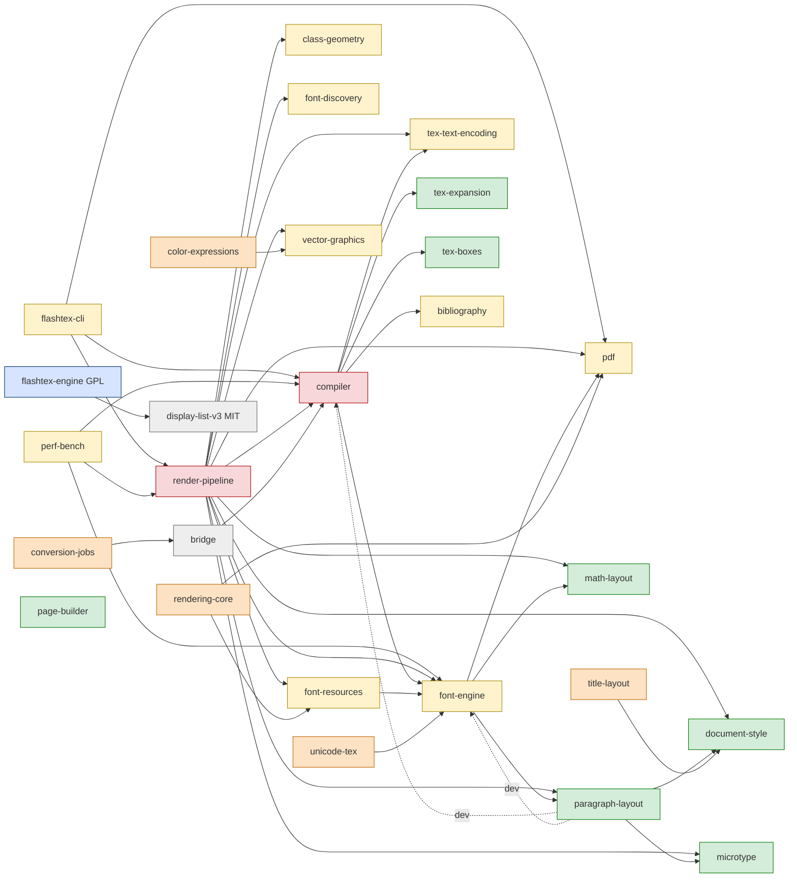

# Engine v2 — P5 retirement plan

**Status:** PROPOSAL for the Commander (lane P5-RETIREMENT-PLAN, #2 comment 5902080143).
It is docs only: no code is deleted by this document.
**Governs:** nothing. [DESIGN.md](DESIGN.md) §10 and §12 (P5) govern. Where this plan and
DESIGN.md disagree, DESIGN.md wins. Items this plan adds beyond §10 are marked
**[ruling needed]**.
**Measured on:** `origin/main` `11d364f75` (2026-09-29). Every number below comes from
the commands in [Appendix A](#appendix-a--evidence-commands). "Verified" means measured
on that tree. "Belief" means inferred and not measured.
**Author:** flashtex-2a/retirement-plan (claude-opus-5-5), delegated by flashtex-e6.

---

## 0. Summary

| | Count |
|---|---|
| Crates retiring outright under §10 (compiler, render-pipeline) | 2 |
| Unused crates, derived to match §10's "ten" **[ruling needed: confirm the list]** | 10 |
| Crates left without a consumer once the above go **[ruling needed]** | 10 (8 orphans + CLI + perf-bench) |
| Crates kept as oracles (§10), plus 2 kept only as their dependencies | 5 + 2 |
| Rust LOC retiring, §10-named (src / tests-dirs) | 161,206 / 82,929 |
| Rust LOC retiring, ten unused crates | 31,852 / 19,132 |
| Rust LOC retiring, orphans + CLI + perf-bench (if ruled) | 82,946 / 17,262 |
| Swift LOC retiring outright (src / tests) | 1,037 / 1,559 |
| Swift LOC adapted (not deleted) | ≈ 6,500 |
| Stages | 9 (S0 done; S1–S8 still to do) |

**Top risks** (details in §6): the T1/T2/T3/T7 gates that P5 depends on are not wired
into CI on main; the bundled `supported-latex.json` loses its source when the compiler
goes, and §3 forbids generating it from GPL code; and 88 open old-path PRs will conflict
with every deletion stage.

---

## 1. Inventory of what retires

LOC is newline count over **tracked** files (`git ls-files`, so no `target/`).
"src" means `*.rs` outside `tests/`, `benches/` and `examples/`, so unit tests inside `src/`
count as src. "tests" means `*.rs` under those three directories. "other" means every other
text file (fixtures, JSON, Markdown, TeX, scripts). Binary files are counted, not measured.

### 1.1 Crates named by §10 ("the compiler's hand parser, … package ports and the marker hand-off"; "render-pipeline's adapter and typeset paths")

| Path | Package | Rust src | Rust tests | Other text | Files (bin) | Why (§10 bullet) |
|---|---|---:|---:|---:|---:|---|
| `crates/compiler` | flashtex-compiler | 88,766 | 39,209 | 65,470 | 753 (28) | Hand parser (`src/parser.rs` 27,405 + `src/parser/`), package ports (`siunitx`, `natbib`, `biblatex`, `amssymb`, `tabular`, `color`, `theorems`, …), and the marker hand-off (`Inline::*` markers that `render-pipeline/src/adapter.rs` re-derives). Includes Appendix G copy #1 (`src/math.rs` 14,061). |
| `crates/render-pipeline` | flashtex-render-pipeline | 72,440 | 43,720 | 253,430 | 1,389 (52) | Adapter (`src/adapter.rs` 14,210), typeset paths (`src/typeset.rs` 16,107 + `src/typeset/`), page builder copy (`pagebuild.rs`), and Appendix G copy #2 (`mathtex/mathtext/mathgrid/mathfont/mathalpha.rs`, 5,308). Also TFM reader #4 (`src/tfm.rs`, 280). |
| `crates/render-pipeline/vendor/` | — | 0 | 0 | 0 | 0 | "The vendored copies". **Already retired** in P0 (#1183, merge `e1e17d8f6`). The only other `vendor*` path, `crates/tex-expansion/vendor-packages/appendix.sty` (314 lines, a real `.sty`), stays with tex-expansion. |
| **Subtotal** | | **161,206** | **82,929** | **318,900** | 2,142 (80) | |

**"The three math layout copies"** (Appendix B.2: "3 Appendix G copies") are copy #1 in
`crates/compiler/src/math.rs`, copy #2 in the render-pipeline `math*.rs` files, and copy #3 in
`crates/math-layout`. §10 also lists math-layout under "kept as oracles". This plan
reads that as: copies #1 and #2 retire with their crates, and math-layout stays as the
oracle. **[ruling needed: confirm this reading; see Q3]**

### 1.2 "The ten unused crates" — derived, not enumerated by DESIGN.md **[ruling needed]**

DESIGN.md names no list. This one was derived with a single criterion: **no Cargo reverse
dependency** (Appendix A.2), **no binary that an app bundles or spawns** (make-app.sh
`HELPER_TABLE`, apps grep), and **no CI or script invocation** (Appendix A.4). Exactly ten
crates meet it. page-builder also meets it, but it is kept by §10.

| Path | Rust src | Rust tests | Other | Only non-Cargo references | Note |
|---|---:|---:|---:|---|---|
| `crates/bibtex-bst` | 5,377 | 115 | 35,125 | `scripts/clippy-debt.txt` | BST interpreter; see Q16 (bundle-mode BibTeX) |
| `crates/collaboration-core` | 1,999 | 2,052 | 11 | coordination/ only | |
| `crates/color-expressions` | 1,375 | 0 | 13 | coordination/ only | depends on vector-graphics |
| `crates/conversion-jobs` | 2,660 | 2,176 | 333 | coordination/, docs/ | `flashtex-review-inbox` binary is not bundled |
| `crates/project-bundle` | 1,205 | 1,799 | 17 | coordination/ only | |
| `crates/rendering-core` | 11,684 | 10,334 | 72,469 | apps/mac docs, `make-app.sh`, `texmf-acceptance.sh` | Its Rust library is unused. Its `tools/verify_bundle_resources.py` and `docs/handoffs/native-assets/manifest.json` **are** used by make-app.sh, so they move first (S1). Display-list-v2 validation is superseded by `crates/display-list-v3`. |
| `crates/spellcheck` | 1,379 | 778 | 13 | coordination/ only | |
| `crates/title-layout` | 777 | 729 | 13 | compiler comments | |
| `crates/toc-layout` | 778 | 537 | 12 | coordination/ only | |
| `crates/unicode-tex` | 4,618 | 612 | 16,952 | none | XeLaTeX/LuaLaTeX layer; outside the pdfLaTeX scope (D1) |
| **Subtotal** | **31,852** | **19,132** | **124,958** | | 1,156 files (24 binary) |

### 1.3 Crates orphaned by §1.1 and §1.2 (not named in §10) **[ruling needed]**

Once §1.1 goes, these crates have no product consumer: their only Cargo reverse
dependencies are retiring crates (Appendix A.2). §10 doesn't name them, so each needs a
ruling. The recommendation is to retire them in S7c, after the TFM readers are extracted.

| Path | Rust src | Rust tests | Other | Reverse deps today → after §1.1 | Recommendation |
|---|---:|---:|---:|---|---|
| `crates/flashtex-cli` | 3,602 | 1,381 | 34 | none (it is the `flashtex` CLI; bundled as `flashtex-cli`; release.yml ships it) | Superseded by an engine-side CLI. Replace, then retire (S7a). Tier-1: release artifact and licence (Q6). |
| `crates/perf-bench` | 3,559 | 0 | 770 | none (perf.yml) | Superseded by the T7 engine bench (§8). Replace, then retire (S7a). |
| `crates/class-geometry` | 6,031 | 2,125 | 5,797 | render-pipeline → none | retire |
| `crates/font-discovery` | 1,215 | 0 | 15 | render-pipeline → none | retire |
| `crates/vector-graphics` | 9,625 | 1,429 | 401 | render-pipeline, color-expressions → none | retire (the TikZ port) |
| `crates/bibliography` | 3,729 | 718 | 438 | compiler → none | retire |
| `crates/pdf` | 16,951 | 5,344 | 6,163 | cli, font-engine, render-pipeline, rendering-core → font-engine only | Retire after S6. `flashtex-pdf-exact` is the app's only export route until the engine exports (§6.3). |
| `crates/font-engine` | 20,755 | 1,946 | 4,311 | compiler, font-resources, perf-bench, render-pipeline, unicode-tex; dev: paragraph-layout, rendering-core → font-resources only | retire, together with the `gates` Core-14 step and `scripts/ci/fetch-glyphlist.sh` |
| `crates/font-resources` | 13,757 | 4,089 | 4,809 | render-pipeline, rendering-core → none | Extract `src/tfm.rs` (680) into the TFM oracle, then retire |
| `crates/tex-text-encoding` | 3,722 | 230 | 43,670 | compiler, render-pipeline → none | Extract `src/tfm.rs` (287) into the TFM oracle, then retire |
| **Subtotal** | **82,946** | **17,262** | **66,408** | | 376 files (50 binary). The subtotal includes the two `tfm.rs` files (967 LOC) that are extracted and **kept**. |

**Not retiring** (it is a product crate, and only its coupling to the old path changes):
`crates/bridge`. Today it depends on flashtex-compiler for one table,
`flashtex_compiler::math::COMMAND_GLYPHS` (Appendix A.3). S1 replaces that with MIT data.
`preview-controller`, `document-runtime`, `project-index`, `edit-ledger`, `project-files`,
`project-manifest`, `package-resolver` and `docstrip` are IDE-side and are not touched. Q7
covers preview-controller's role once its runtime-v1 producer is gone.

### 1.4 apps/mac code paths (Swift)

**Retire outright** (their only producer is the old path):

| Path | LOC | Why |
|---|---:|---|
| `apps/mac/Sources/FlashTeXMac/DisplayListDelta.swift` | 433 | consumes `display-list-v2-delta`, which `render-pipeline/src/delta.rs` produces. v3 carries per-page content hashes instead (§6.1). |
| `apps/mac/Sources/FlashTeXMac/V2PageWindow.swift` | 165 | `display-list-v2-window` negotiation with flashtex-render; v3 streams pages |
| `apps/mac/Sources/FlashTeXMac/BundledMetrics.swift` | 155 | points `FLASHTEX_TFM_DIRS` at the bundled TFMs for flashtex-render |
| `apps/mac/Sources/FlashTeXMac/WholeDocumentList.swift` | 210 | fetches a whole v2 list from flashtex-render for export and print |
| `apps/mac/Sources/FlashTeXProtocol/LayoutNegotiation.swift` | 74 | runtime-v1 layout capabilities (`FLASHTEX_LAYOUT_CAPABILITIES`) |
| `ShellModel.swift`: `locateRenderPipeline` / `locateCompiler` / `locateDefaultProducer` / `attachDiscovered*`, and the auto-attach branch (L764–L778, L1085–L1160) | ≈ 90 | spawn flashtex-render or flashtex-compiler. They also still probe stale `crates/<crate>/target/` paths from before the workspace. |
| **Sources subtotal** (excluding ShellModel) | **1,037** | |
| `Tests/FlashTeXMacTests/{DisplayListDeltaTests 326, BundledMetricsTests 359, V2WindowTests 331, LayoutCapabilityConsumerTests 543}.swift` | **1,559** | tests of the above |
| `Tests/FlashTeXMacTests/RealCompilerTests.swift` | 240 | retarget to the engine host; don't delete |

**Adapt, don't delete** (6,525 LOC in the files listed here, excluding `Completion.swift`). §10 reuses the app and §6.2 keeps the renderer:
`FlashTeXProtocol/RenderingV2.swift` (1,102) and `RenderingV2Fast.swift` (1,229) gain a v3
decoder that feeds the same `V2PreparedPage`; `RuntimeV1.swift` (791) keeps only what
diagnostics still need; `ExactPDFExport.swift` (207) moves to the engine's PDF;
`Fonts.swift` (358) and `ProjectFonts.swift` (440) lose their fallback faces, because v3
carries `FONT` resources; the preview-controller route (`ShellModel+Controller.swift` 666,
`PreviewControllerClient.swift` 424, `HistoricalPreview.swift` 472,
`ShellModel+DisplayCandidates.swift` 836) depends on Q7; `Completion.swift` (4,053)
changes only its vocabulary source (Q5).

**Bundle resources:** `apps/mac/Fonts/` (11 MB, 688 files, 3.0 MB of it `texmf/` TFMs)
exists for flashtex-render and the CI `FLASHTEX_{FONT,TFM,LM}_DIRS` env. It retires in S7c
unless the P3 bundle (#1216, TTBv1) reuses it. `Resources/Fonts/JetBrainsMono-*` (the
editor font) stays. `make-app.sh` `HELPER_TABLE` rows `compiler`, `render`, `pdf`,
`pdf_exact` and `cli` are replaced in S6 by the engine host.

### 1.5 apps/ios

The iPad companion contains no engine code (D14). No iPad Swift retires. One input
changes: `apps/ios/FlashTeXPad/Resources/supported-latex.json` (1,529 lines) is a
byte copy of `crates/compiler/supported/supported-latex.json`, synced by
`apps/mac/scripts/sync-supported-latex.sh`. When the compiler goes, the file needs a new
**MIT** source, because §3 forbids generating it from GPL code (Q5, S1).

### 1.6 Tests outside the retiring crates

| Path | LOC | Action |
|---|---:|---|
| `crates/paragraph-layout/tests/{adversarial 401, mismatch_fixtures 313, hyphenation_spans 269}.rs` | 983 | These are dev-dependencies on flashtex-compiler and flashtex-font-engine (`Cargo.toml` L24–26). They **block** the compiler's deletion. S1 rewrites them against paragraph-layout's own API, or moves them into the compiler's tests so they retire with it. |
| `tests/test_rendering_v2.py` | — | Belongs to rendering-core and display-list-v2. It retires with rendering-core in S2 **[verify in S2]**. |

### 1.7 CI jobs (`.github/workflows`, 1,675 lines in total)

| Job (file) | Today | Action and stage |
|---|---|---|
| `rust-standalone` matrix {render-pipeline, flashtex-cli} (ci.yml L453–484) | full tier; listed in `CI required` | delete (S7a) and remove it from `ci-required.needs` |
| `inventory` (ci.yml L276–286), and the mac-app step "Completion vocabulary is the compiler's inventory" | compares the bundled vocabulary with `crates/compiler/supported/` | repoint to the new MIT source (S1) |
| `gates`: the "Core 14 AFM tables re-derive" step (ci.yml L307–323) | font-engine only | delete with font-engine (S7c) |
| `parity-fixtures` / `parity-fixtures-hosted` (via `.github/actions/parity-fixtures`) | builds `crates/flashtex-cli` and checks `baseline-fixtures.json` | dual-run (S4), then the engine only, with the baseline re-recorded (S5) |
| `rust-workspace` env `FLASHTEX_FONT_DIRS/TFM_DIRS/LM_DIR` | needed by the compiler, render-pipeline, pdf, rendering-core, font-engine, tex-text-encoding, unicode-tex, document-runtime and preview-controller tests (Appendix A.5). No kept oracle crate needs it. | drop when the last of those crates goes (S7c). Check document-runtime and preview-controller first. |
| `mac-app` step "Build every bundled helper" (`scripts/ci/build-helpers.sh`) | builds the old helpers | shrink its `HELPERS` rows (S6) |
| perf.yml `bench` ("engine performance") | perf-bench over the old path; digests gate everywhere | dual-run with T7 (S4), then replace (S7a). See §4.1. |
| nightly.yml `parity-corpus` | `--engine` = the flashtex CLI | engine-host candidate (S5) |
| nightly.yml `workspace-debug`, `excluded-crates`, `clippy-debt` | name render-pipeline, flashtex-cli and perf-bench | edit the lists per stage |
| release.yml `macos` / `linux` | `build-helpers.sh`, `package-cli.sh`, smoke tests of `flashtex` and `flashtex-render` | replace with engine distribution (S7a). **Tier-1** (Q6). |
| `trip`, `etrip`, `pdftex-regression`, `boundary`, `build`, `quick` | engine and boundary | unchanged |

### 1.8 Scripts and tools

| Path | LOC | Action |
|---|---:|---|
| `scripts/render-corpus-v2.sh` | 42 | retire (flashtex-render only), S7a |
| `scripts/caret_context_oracle.py` | 102 | retarget its `--flashtex` default (flashtex-render) to the engine host, S6 |
| `scripts/ci/build-helpers.sh` | 114 | drop rows cli, compiler, pdf and render-pipeline (S6/S7) |
| `scripts/ci/package-cli.sh` | 135 | replace (S7a, Q6) |
| `scripts/ci/fetch-glyphlist.sh` | 77 | retire with font-engine (S7c) |
| `scripts/generated-manifest.json` / `check-generated.py` | 15 entries | 8 compiler entries go in S7b, 2 font-engine entries in S7c and 2 tex-text-encoding entries in S7c; the 3 math-layout entries stay |
| `scripts/clippy-debt.txt`, `scripts/rust-test-exclude.txt` | — | remove retired crates in each stage (the lists may only shrink) |
| `scripts/gate.sh` | 592 | S8: map `tests/oracles/*` to packages if the oracles move |
| `tools/font-metric-sweep` | 26 | retire (it is a render-pipeline binary), S7a |
| `tools/kernel-math-gap` | 839 | retire (compiler gap list), S7b |
| `tools/real-world-corpus` (1,675), `tools/visual-oracle` (4,028), `tools/typing-bench` (576), `tools/native-validation` (313,929, mostly `reports/`) | — | Retarget to the engine host. §10 reuses visual-oracle. `native-validation/mac-live/reports/` is evidence and stays. |
| `tools/parity`, `tools/lockstep`, `tools/latex-suites`, `tools/displaylist`, `tools/web2rust`, `tools/snapshot-bench` | — | kept (engine-side) |

### 1.9 Docs and generated data

**Docs retiring** (they describe only the old path; 4,146 lines):
`docs/proposals/display-list-v2-delta.md` (1,145), `node-stream-inventory.md` (694),
`font-system-math.md` (324), `packages-fonts-manifest.md` (235), `pdf-searchable-text.md`
(163), `rendering-abi.md` (120), `contract-draft-review-ad922ea.md` (73);
`docs/contracts/runtime-v1-layout-capabilities.md` (77), `rendering-v2-proposal.md` (219);
`docs/resources/ft005-duplication.md` (68); `docs/handoffs/paragraph-layout-forced-break/`
(1,028). **Rewrite:** `docs/user/compiler.md` (1,524) for the engine CLI, and
`docs/user/project-manifest.md` `[fonts]` (Q15). **Keep:** `docs/evidence/` (1,035 files;
an append-only record) and `docs/contracts/runtime-v1*.md` until Q7 is decided. The
crates' own READMEs and docs go with their crates (they are counted in "other" above).
`docs/INDEX.md` links are updated in the same PR as each deletion.

**Generated data:**
- Compiler: `kernel_lengths.rs` 7,325, `color_names.rs` 557, `text_fontdimens.rs` 210 and
  `supported/canonical-latex.tsv` 1,331, plus 911 lines of generators. They go with the
  compiler.
- font-engine: `generated.rs` 14,857 plus `gen_tables.py` 316.
- tex-text-encoding: `generated.rs` 1,022 plus `extract_tables.py` 334.
- The three copies of `supported-latex.json` (1,529 each) get a new source.
- Re-recorded, not deleted: `tools/parity/baseline-fixtures.json` and
  `crates/perf-bench/baselines/linux-x86_64-ryzen7-7800x3d.json`. See §4.1.

---

## 2. What is kept as oracles and tests (§10)

| Crate | LOC (src / tests / other) | Consumers today (Cargo) | Consumers after switch-over | Moves under `tests/`? |
|---|---|---|---|---|
| tex-expansion | 12,908 / 3,836 / 4,218 | flashtex-compiler | its own tests; a differential oracle for T6 expander fuzzing (it links no engine) | yes, in S8 → `tests/oracles/tex-expansion` |
| tex-boxes | 3,655 / 1,146 / 4,326 | flashtex-compiler | its own tests; a T6 box-builder oracle | yes, in S8 |
| paragraph-layout | 6,649 / 5,914 / 41,200 | font-engine, render-pipeline; dev: compiler | its own tests, once the 983 compiler-dependent test LOC are rewritten in S1 | yes, in S8, **with** document-style (2,323 src) and microtype (1,678 src), its normal dependencies. They are kept only for that reason. |
| math-layout | 11,394 / 3,518 / 1,771 | font-engine, render-pipeline | its own tests (`golden.rs`, `opentype_extras.rs`); its generated `cm_tfm.rs` / `ams_tfm.rs` stay under `check-generated.py` | yes, in S8 |
| page-builder | 2,386 / 245 / 105,214 | none | its own tests and `oracle/fixtures` (a `vspace-03.tex` case is cited by compiler tests, which retire) | yes, in S8 |
| TFM readers | `math-layout/src/tfm.rs` 187, `tex-text-encoding/src/tfm.rs` 287, `font-resources/src/tfm.rs` 680 (and `render-pipeline/src/tfm.rs` 280) | inside their crates | a single `tests/oracles/tfm-readers` crate with one module per reader, differentially tested against each other and against the engine's TFM loader by the T6 parser fuzzer. The render-pipeline copy is dropped, since it duplicates tex-text-encoding's `tex.web` §560–575 scaling **[ruling needed]**. | yes, extracted in S7c |

**Why move them under `tests/`:** it makes the product/oracle split visible. It keeps
them out of the §14 "unused crates" metric. It prevents product code from depending on
them again. **Cost:** `Cargo.toml` `members` gains `"tests/oracles/*"`; `scripts/gate.sh`'s
path→package mapping (L170–229) and ci.yml `plan` path filters learn the new root. The
alternative is to leave them in `crates/` with `publish = false` and a README banner. That
is cheaper, but the product/oracle line then stays implicit. **[ruling needed]**

**Licence:** the oracles stay MIT and must never depend on flashtex-engine. The engine's
tests may dev-depend on them, because GPL→MIT is allowed. The boundary check (A) already
enforces this.

---

## 3. Dependency graph

### 3.1 Cargo (from `cargo metadata --no-deps`, path dependencies; `-.->` = dev)



The following have no edges into the old path and are omitted: collaboration-core,
project-bundle, spellcheck, toc-layout and bibtex-bst (unused); and preview-controller,
document-runtime, project-index, edit-ledger, project-files, project-manifest,
package-resolver, docstrip and web2rust (product/engine side). `rendering-core`, dev on
font-engine and project-files, is omitted for clarity.

**Reverse dependencies that block a deletion** (who must move first):
- compiler ← bridge (`COMMAND_GLYPHS`), paragraph-layout (dev), flashtex-cli, perf-bench,
  render-pipeline.
- render-pipeline ← flashtex-cli, perf-bench.
- font-engine ← font-resources, unicode-tex, paragraph-layout (dev), rendering-core (dev).
- pdf ← font-engine, rendering-core, flashtex-cli.

### 3.2 Non-Cargo edges (Swift, scripts, CI)

- **Mac app → binaries** (process spawn, not link): `flashtex-render` and
  `flashtex-compiler` (`ShellModel.swift`), `flashtex-pdf-exact` (`ExactPDFExport.swift`),
  `flashtex-bridge` (`BridgeClient.swift`) and `flashtex-preview-controller`, which itself
  spawns a runtime-v1 "producer", `crates/preview-controller/src/main.rs` `producer_command`.
  `make-app.sh` bundles all of them. Swift Package deps: only `tools/nearby-client` and
  swift-snapshot-testing. **No Rust is linked into the app.**
- **iPad → data:** `supported-latex.json` (copied from the compiler).
- **CI → crates:** §1.7. **Scripts → binaries:** §1.8.

### 3.3 MIT→GPL edges the switch-over could create (§3 forbids every one)

**Today:** there are none. flashtex-engine → display-list-v3 is GPL→MIT, which is allowed;
`scripts/license-boundary-allow.txt` is empty; check A passes. **Verified** from the
metadata.

| Tempting edge | Why it would be tempting | Boundary-safe route (display-list-v3 / process) |
|---|---|---|
| flashtex-cli → flashtex-engine | "the engine is linked in, never spawned" (`flashtex-cli/src/main.rs` L17) | The CLI becomes a GPL binary inside `crates/flashtex-engine`, next to `flashtex-host`, `flashtex-initex` and `flashtex-dist`. Or an MIT CLI spawns `flashtex-host` and speaks v3 through `crates/display-list-v3` `client.rs`. |
| perf-bench → flashtex-engine | a T7 bench wants the engine's internals | Put the T7 bench on the GPL side (`crates/flashtex-engine/benches` or a GPL bench binary), or drive `flashtex-host` over the socket. |
| preview-controller → flashtex-engine | it owns "the original compiler behind it" | It spawns `flashtex-host`, as it spawns producers today. |
| bridge → engine data | replacing `COMMAND_GLYPHS` | Use an MIT table, or the v3 `FONT`/glyph data at run time. |
| supported-latex.json generated by engine code | an easy dump of the engine's control-sequence table | §3 forbids it for the iPad. Use an MIT generator (Q5). |
| apps/mac `Package.swift` linking a Rust static lib | lower latency than the socket | **Not caught today:** check A covers Cargo only and check B covers apps/ios only. S1 adds **check C**: no `linkerSettings`, `unsafeFlags` or `.systemLibrary` target in apps/mac reaches a GPL artifact, and `make-app.sh` only *copies* `flashtex-host` as a separate executable (aggregation). |
| kept oracles → engine (after the move to `tests/`) | a "differential test" written from the oracle's side | Put differential tests on the engine side (GPL → MIT oracle). Check A still covers `tests/oracles/*` because it scans every workspace member. |

---

## 4. Staged deletion order

Every stage is one coherent PR (or one PR per sub-stage), landed through the merge queue.
"Green" means these checks pass:
- `scripts/gate.sh pr` locally before pushing;
- the `CI required` check on the PR (fast tier: `build`, `quick`, `boundary`, `inventory`,
  `gates`, `parity-fixtures[-hosted]`, `trip`, `etrip`);
- the full tier on `merge_group` (`rust-workspace` on Ubuntu and macOS, `rust-standalone`
  while it exists, `pdftex-regression`, `mac-app`, `ipad`);
- perf.yml `engine performance`;
- where stated, T1 (`tools/lockstep`, 0 new differences), T2 (`tools/latex-suites`, 0
  unexpected) and T3 (`tools/parity` tiers, never falls).

Each stage's rollback is `git revert` of its merge commit, plus the specific steps listed.
Before each deletion stage (S2, S7a–c, S8) the Commander tags `pre-retire-<stage>` on
main, so any file can be restored with `git checkout <tag> -- <path>`.

| Stage | Contents | Preconditions | Gates (beyond green) | Rollback |
|---|---|---|---|---|
| **S0 ✔** | `crates/render-pipeline/vendor/` retired | — | done: #1183 (`e1e17d8f6`) | — |
| **S1 Decouple** (no behaviour change) | (a) rewrite or move the 983 paragraph-layout test LOC off compiler and font-engine; (b) bridge: an MIT `COMMAND_GLYPHS` replacement; (c) an MIT generator for `supported-latex.json`, and repoint `inventory` and `sync-supported-latex.sh` to it; (d) move `verify_bundle_resources.py` and the native-assets manifest from rendering-core to `apps/mac/scripts/`; (e) boundary **check C** for apps/mac; (f) add `host`/`host_fingerprint` to the parity baseline schema; (g) remove the stale `crates/<crate>/target` probes in ShellModel | Q5 decided | The perf digests must be **unchanged**: they prove no behaviour change. `sync-supported-latex.sh --check` passes. | revert |
| **S2 Ten unused crates** | delete §1.2 and `tests/test_rendering_v2.py`; edit clippy-debt and rust-test-exclude (rendering-core leaves it, #992); update docs/INDEX | the Commander confirms the list (Q1); S1(d) landed. **No scoreboard dependency**, so it may land before P5's flip. | full tier: `rust-workspace` on both OSes; `make-app.sh` bundle-resource verification still passes | revert |
| **S3 App flag, default legacy** | §5's machinery; `EngineHostProducer` over display-list-v3; `engine-policy.json` = `legacy` | P3 exit: P-T2 on fixtures; preview parity check at zero tolerance (§6.2) | `mac-app`, `ipad`; `V2Parity` zero tolerance for both producers; the licence boundary with check C | policy stays `legacy`; revert |
| **S4 Dual-run gates** | wire **T1** (PR tier, touched engine areas), **T2 + T3 + T7** (merge queue) into ci.yml; `parity-fixtures` runs both engines; a new T7 bench on the GPL side with baselines recorded **on each reference host by its owner** (§4.1); perf-bench keeps running | S3; a T7 harness exists | N consecutive green `merge_group` runs with both engines (the Commander picks N; this plan suggests 10) | revert CI; the old gates are untouched |
| **S5 Flip (per-document default)** | `engine-policy.json`: `legacy` → `new-for-new-documents` → `new` (two PRs); nightly `parity-corpus` and `parity-fixtures` default `--engine` → engine host; re-record `baseline-fixtures.json` for the new engine on the Mac host class that recorded it | **§12 P5:** scoreboard new ≥ old on **every** tier and level (fixtures, arXiv, templates, packages; L0–L3; P-T1, P-T2); **arXiv L1 ≥ 90%**. Status: arXiv L1 is 97.9%, independently reproduced (#1224); packages are P-T2 90/91 and L1 98.9%, against v1's 0/91 and 9.9% (branch `agent/flashtex-2a/packages-tier`, under review). See R7; **§1.2 latency targets** met on the T7 10/100/300/1,000-page benches (the P4 exit); T2 has 0 unexpected failures; T1 has 0 new differences | 14-day soak (one design review, §14) with no open P0 attributed to the new engine | Flip the policy back (one line), with no code revert. Users: per-document override. |
| **S6 App old route out** | delete the §1.4 "retire outright" files and tests; remove `legacy` from `EngineChoice`; `ExactPDFExport` → engine PDF; `make-app.sh` `HELPER_TABLE` and `build-helpers.sh` rows compiler, render, pdf, pdf_exact and cli out, host in; retarget `caret_context_oracle.py`, typing-bench, visual-oracle, real-world-corpus and native-validation | S5 soak passed | `mac-app`, `ipad`, the `make-app.sh` packaging self-test (`packaging-selftest.sh`) | revert, which restores the route while the crates still exist |
| **S7a Top of the old graph** | delete render-pipeline, flashtex-cli and perf-bench; `rust-standalone` out of ci.yml and `ci-required`; perf.yml → T7 only; release.yml → engine distribution; nightly lists; `render-corpus-v2.sh`, `tools/font-metric-sweep` | S6; T7 gating for ≥ N runs; Q6 ruled (release and licence) | full tier; release.yml dry-run (`workflow_dispatch`) | revert (from the `pre-retire-S7a` tag) |
| **S7b Compiler** | delete `crates/compiler`; 8 generated-manifest entries; `tools/kernel-math-gap` | S1(a–c) and S7a landed; the 88 open old-path PRs closed or landed (Q10) | full tier; `check-generated.py` | revert |
| **S7c Orphans** | extract the TFM readers into `tests/oracles/tfm-readers`; delete §1.3's crates as ruled; the `gates` Core-14 step, `fetch-glyphlist.sh`, the `FLASHTEX_*_DIRS` env; `apps/mac/Fonts/texmf` (unless P3 reuses it) | Q2 ruled; S7b | full tier; the TFM oracle tests pass | revert |
| **S8 Oracles to `tests/`, final sweep** | move the §2 crates (with document-style and microtype) to `tests/oracles/`; `members` glob; gate.sh mapping; docs §1.9; code-health metrics (§14) | S7c; Q4 (move or not) ruled | full tier; Appendix A.4 re-run finds **zero** references to retired names outside `docs/evidence/` and `coordination/` | revert |

### 4.1 Perf-digest implications

- perf.yml gates **output digests everywhere** and **timings only on the same host**
  (`--require-same-host`). The one committed baseline,
  `crates/perf-bench/baselines/linux-x86_64-ryzen7-7800x3d.json`, was recorded on host
  `nixos` (fingerprint `linux/x86_64/AMD Ryzen 7 7800X3D 8-Core Processor/16cpu`) at
  `862cfb40e`. It holds 26 cases, and its digests are the **old path's** display-list and
  PDF bytes (`cold.reply`, `export.pdf`, `warm.*.v1/v2`). **Verified.**
- Under D13 the old path takes fixes only, so any digest change between now and S7a is a
  behaviour change that needs its own re-record PR (the #1070 and #1122 precedent).
- The **new engine's digests are a different quantity**: v3 pages and P-T2 PDF. They are
  **new baselines, not re-records**. T7 (§1.2) targets are M-series, so the T7 baseline is
  recorded on a Mac reference host (the Commander names it, for example mac-m5pro-kabir).
  A Linux T7 baseline, if one is wanted, is recorded on the NixOS reference host by its
  owner (#1232 moves Linux jobs there, which would make its timings gate).
- **§8: never record host-dependent data on another host.** The `unicode-accents`
  precedent applies to any case that paints from system fonts: record it per OS, or exclude
  it from cross-OS digests. The new engine resolves fonts from TeX Live or the bundle
  (D12), so its digests should be host-independent **(belief; S4 verifies it by recording
  on two hosts and comparing)**.
- `tools/parity/baseline-fixtures.json` (recorded 2026-09-22 with
  `flashtex 0.1.0 (351f1db1ae08)`) **stores no host**, so a same-host re-record cannot be
  proved. S1(f) adds the host field before S5 re-records it on macOS.
- perf-bench and its baseline are deleted in S7a, **after** T7 has gated for N runs, never
  before, so perf is never ungated.

---

## 5. Switch-over flag design (app)

**Goal:** the new engine becomes the default per document once the scoreboard shows it
ahead (§12 P5). A user or the Commander can override it, rollback is instant, the
evidence needs no telemetry, and the preview is correct under either engine during the
overlap.

### 5.1 Resolution order (highest wins)

1. **Environment** `FLASHTEX_ENGINE=new|legacy`: the Commander, CI and dev override.
   The status bar shows "(set by environment)".
2. **Per-document user override:** *Typeset ▸ Engine ▸ Standard / Legacy* (product
   text says "pdfLaTeX-compatible", never "TeX engine" or "pdfTeX", per §3). Stored
   **app-locally**, not in the project.
3. **Policy default** from the bundled `Resources/engine-policy.json`:

```json
{ "schema": "flashtex-engine-policy/1",
  "default": "legacy | new-for-new-documents | new",
  "evidence": { "main_sha": "…", "scoreboard": "tools/parity report sha256",
                "tiers": { "fixtures": {"new": …, "old": …}, "arxiv": {…}, "templates": {…} },
                "t7": "bench report sha256" } }
```

`new-for-new-documents` means: the new engine for any document with no recorded
history, and the legacy engine for documents already typeset with it. This is the "per
document" default: existing work is never silently re-typeset by a different engine.
Each such document gets a one-time, dismissible banner offering "Try the standard engine".

**Rejected:** a `flashtex.toml` key. Engine choice is transitional. A key written into
projects outlives the overlap, reaches collaborators through git, and makes older builds
warn (`manifest_unknown_key`).

### 5.2 Persistence

`~/Library/Application Support/FlashTeX/engine-choice.json` is keyed by the canonical
project root plus the entry path. Each entry stores `{choice, source: user|policy,
last_engine, set_at, app_version, reason?}`. It is written atomically. A missing or corrupt
file means "no history", so the policy default applies. It is removed in S6, when
`legacy` goes.

### 5.3 Preview during the overlap

- **One engine per document at a time.** There is no dual-run in the product: it would
  double the cost and confuse diagnostics. A `PreviewProducer` protocol has two
  implementations. `LegacyProducer` wraps today's runtime-v1 stdio route, through
  flashtex-render or the preview-controller helper. `EngineHostProducer` runs
  `flashtex-host` and speaks display-list-v3 over its Unix socket. Both produce
  `V2PreparedPage`, so `GlyphRunRenderer` and `V2PageRasterizer` are unchanged (§6.2).
- **Switching engine** cancels in-flight work and tears down the producer. It clears the
  page cache: cache keys carry the engine id, and v3 pages also carry their content hash,
  so there is no cross-engine reuse. It keeps the viewport through the source-span anchor
  (`PreviewAnchor.swift`): v2 byte spans on one side, v3 span ids on the other.
- **Export and print always use the active engine.** Legacy uses
  `flashtex-pdf-exact from-v2`; the new engine uses its own PDF backend (P-T2). The two are
  never mixed, because the preview must match the exported PDF at zero tolerance (§6.2).
- **Diagnostics** come from runtime-v1 on one path and from the engine log on the other.
  Each is labelled with the engine that produced it.
- **Faults:** the host process isolates engine crashes (§7). It restarts with backoff.
  After 3 crashes on one document, a banner offers Legacy. The user must choose; the app
  never switches silently, because a silent fallback would hide parity bugs.
- **Dev-only compare mode** (`FLASHTEX_ENGINE_COMPARE=1`) runs both engines and overlays
  their differences. It is never on in release builds.

### 5.4 Evidence without telemetry

- The **gating evidence** is in the repo: the tools/parity tiers (fixtures, arXiv,
  templates), T4 nightly and the T7 reports. Their hashes are embedded in
  `engine-policy.json`, and a drift gate in `inventory` checks that the file names a
  scoreboard report that exists.
- **User evidence is opt-in and local:** *Help ▸ Copy Engine Report* copies JSON (app
  version, policy, per-document choice, the last N compile outcomes and timings, crash
  counts; no document content) for the user to paste into an issue. Nothing goes over the
  network.
- **Team dogfooding** is recorded through `tools/native-validation` reports, which are
  committed evidence.

### 5.5 Rollback

- **Commander:** set the policy back to `legacy` and ship. This needs no code change, and
  works until S6.
- **User:** the per-document menu, until S6.
- **Code:** revert the stage. From S7 on, restoring the old path means reverting deletions,
  which is why S5 has a soak and each deletion has a `pre-retire-*` tag.

---

## 6. Open questions and risks

| # | Question or risk | Evidence needed to resolve it |
|---|---|---|
| Q1 | The "ten unused crates" list is derived here (§1.2); DESIGN names none. | The Commander confirms or edits the list. Re-run Appendix A.2 and A.4 on the landing SHA. |
| Q2 | Ten crates orphaned but not named in §10 (§1.3): retire them? | A ruling. For pdf and font-engine: confirm that no IDE feature (for example searchable-text or font previews) calls them after S6. Grep apps/ and crates/ on that SHA. |
| Q3 | §10 names "three math layout copies" as retired and math-layout as kept. | A ruling that copies #1 and #2 retire and math-layout stays (§1.1). |
| Q4 | Move the oracles under `tests/`, or keep them in `crates/` with a banner? | A cost-and-value ruling (§2). The measure is the size of the gate.sh / ci `plan` diff. |
| **R1** | **T1/T2/T3/T7 are not in CI on main.** ci.yml invokes neither `tools/lockstep` nor `tools/latex-suites`; the T3 arXiv/templates tiers run only nightly; there is no T7 job. P5's "≥ on every tier" and latency preconditions cannot be *gated* until S4 wires them. | S4's PR, and N green `merge_group` runs. |
| **R2 / Q5** | **`supported-latex.json` loses its source** when the compiler goes. It is an inventory of what the *hand port* supports, which is meaningless for a real engine. §3 requires the iPad copy to come from MIT data. | Decide what completion should offer: for example the LaTeX kernel plus the documented commands of installed packages, generated by an MIT script from TeX Live `.sty`/`.dtx` names (names are facts, but LPPL provenance goes to the §3 legal review). S1(c) prototypes it and diffs it against today's file. |
| **R3 / Q10** | **88 open PRs** target old-path crates (titles start `compiler`, `render-pipeline`, `tikz`, `pdf` or `rendering-core`; `gh pr list`, 2026-09-29). Under D13 most are features, not fixes. Each one conflicts with S7a–c. | The Commander closes or lands them before S7a. The measure is the count of open PRs touching the retiring paths, which must be 0. |
| Q6 | **Release artifacts (Tier-1):** release.yml ships an MIT `flashtex` CLI tarball built from the old path. Its replacement is GPL, v2-or-v3 only because of xpdf (§3), and needs a source offer. | An owner/Commander ruling, and the §3 legal review. |
| Q7 | preview-controller and runtime-v1: does the helper spawn `flashtex-host` and translate, or does the app talk v3 directly and keep the helper for ledger and index only? | A P3/P4 integration decision. The measure is keystroke→paint latency through each route (typing-bench). |
| Q8 | The parity baseline stores no host (§4.1), so §8 compliance of the S5 re-record can't be shown. | S1(f): add the field; record on the same Mac class. |
| Q9 | The T7 harness location and reference hosts. | The Commander names the hosts. The harness must sit on the GPL side, or behind the socket (§3.3). |
| R4 | Boundary gap: check A covers Cargo and check B covers apps/ios; nothing checks apps/mac `Package.swift`. | S1(e) check C, plus a negative test (a fixture target that links a GPL lib must fail it). |
| R5 | 23 of 42 packages have `license = None` in their metadata, so licence audits can't be automated. | Add `license = "MIT"` to surviving MIT crates in S8. `cargo metadata` must show no `None`. |
| R6 | rendering-core's `verify_bundle_resources.py` is live in `make-app.sh` and `texmf-acceptance.sh`. Deleting the crate first would break packaging. | S1(d) lands before S2; `packaging-selftest.sh` passes. |
| Q15 | The `flashtex.toml` `[fonts]` roles are an old-engine feature (the compile request injects them). Under a real engine a document's fonts come from the document. | A ruling: drop them, or map them to an injected preamble (which would break parity). Measure against the fixtures that use `[fonts]`. |
| Q16 | BibTeX in bundle mode (D12, no TeX Live): does the TTBv1 bundle (#1216) carry `bibtex`, or would the MIT `bibtex-bst` be reused, which would move it out of §1.2? | Read #1216's bundle manifest; run a `natbib` fixture with TeX Live absent. |
| R7 | The scoreboard lead is measured, but not yet on main. **arXiv tier (#1224):** new engine L1 137/140 = 97.9%, against v1's 0.7%. An independent review reproduced these numbers byte-identically on 13 documents on a different host ([#1224 comment 5896172295](https://github.com/flash-tex/flashtex/pull/1224#issuecomment-5896172295); the re-review at `1dc1f9e8a`, MERGE-READY, is [comment 5896355335](https://github.com/flash-tex/flashtex/pull/1224#issuecomment-5896355335)). **Packages tier** (branch `agent/flashtex-2a/packages-tier`, under review): new engine P-T2 90/91 and L1 98.9%, against v1's P-T2 0/91 and L1 9.9%. This lane did not measure either tier itself. | #1224 and the packages tier land; the S5 preconditions are re-measured on the flip SHA. |
| R8 | The rollback window shrinks after S7: a revert of 160k+ LOC is costly once later changes stack on top. | The S5 soak, the `pre-retire-*` tags, and landing S7a–c close together. |

---

## Appendix A — Evidence commands

Run from the repository root at the SHA being measured (this plan: `11d364f75`).

**A.1 LOC per crate.** Tracked files only, classified as in §1:

```python
# loc.py <dir>...   ->  dir, rust_src, rust_tests, other_text, files, binary_files
import subprocess, sys, os
def lines(p):
    b = open(p, 'rb').read()
    return None if b'\0' in b[:8192] else b.count(b'\n')
for d in sys.argv[1:]:
    s = t = o = n = nb = 0
    for f in subprocess.run(['git', 'ls-files', '-z', '--', d], capture_output=True).stdout.decode().split('\0'):
        if not f: continue
        n += 1; l = lines(f)
        if l is None: nb += 1; continue
        if f.endswith('.rs'):
            if os.path.relpath(f, d).split(os.sep)[0] in ('tests', 'benches', 'examples'): t += l
            else: s += l
        else: o += l
    print(d, s, t, o, n, nb, sep='\t')
```

`python3 loc.py crates/* tools/*`

**A.2 Cargo graph.** Forward and reverse path dependencies:

```sh
cargo metadata --format-version 1 --no-deps > meta.json
python3 - meta.json <<'EOF'
import json, sys
m = json.load(open(sys.argv[1])); r = {}
for p in m['packages']:
    for d in p['dependencies']:
        if d.get('path'): r.setdefault(d['name'], []).append(p['name'] + ('' if not d['kind'] else f"({d['kind']})"))
    print(p['name'], p.get('license'), '->', [d['name'] for d in p['dependencies'] if d.get('path')])
for n in sorted({p['name'] for p in m['packages']}): print(n, '<-', sorted(r.get(n, [])))
EOF
```

**A.3 What each consumer imports from the compiler:**
`grep -rhoE 'flashtex_compiler::[a-zA-Z_]+(::[a-zA-Z_]+)?' crates/bridge crates/flashtex-cli crates/perf-bench crates/paragraph-layout/tests | sort | uniq -c`

**A.4 Non-Cargo consumers.** For each crate, list the tracked files outside it that name its
directory, package, library or binary. This is a regex over `git ls-files`, run with a
Python script of about 40 lines that takes about 3 minutes. Spot checks:

```sh
grep -rn -E 'flashtex-(render|compiler|bridge|preview-controller|pdf-exact)"' apps/mac/Sources
sed -n '/^HELPER_TABLE=(/,/^)/p' apps/mac/scripts/make-app.sh
grep -n -o -E 'tools/[a-z0-9-]+|scripts/[a-z0-9./-]+' .github/workflows/*.yml .github/actions/*/action.yml | sort | uniq -c
grep -rlE 'crates/(compiler|render-pipeline|flashtex-cli|math-layout|font-engine)|flashtex-(render|compiler|cli)\b' tools scripts
```

**A.5 Crates whose tests need the bundled font env:**
`grep -rl -E 'FLASHTEX_(TFM_DIRS|FONT_DIRS|LM_DIR)|apps/mac/Fonts' crates | cut -d/ -f2 | sort | uniq -c`

**A.6 Swift sizes:**
`wc -l apps/mac/Sources/FlashTeXMac/{DisplayListDelta,V2PageWindow,BundledMetrics,WholeDocumentList}.swift apps/mac/Sources/FlashTeXProtocol/*.swift`

**A.7 Baselines:**

```sh
python3 -c "import json;d=json.load(open('crates/perf-bench/baselines/linux-x86_64-ryzen7-7800x3d.json'));print(d['meta']['host_fingerprint'],d['meta']['repo_commit'],len(d['cases']))"
python3 -c "import json;print({k:v for k,v in json.load(open('tools/parity/baseline-fixtures.json')).items() if k!='levels'})"
```

**A.8 Generated tables:**
`python3 -c "import json;print('\n'.join(sorted(json.load(open('scripts/generated-manifest.json'))['sha256'])))"`

**A.9 Open old-path PRs:**
`gh pr list --repo flash-tex/flashtex --state open --limit 200 --json title --jq '.[].title' | grep -c -E '^(compiler|render-pipeline|tikz|pdf|rendering-core|compiler\+|fix\(render-pipeline\))'`
